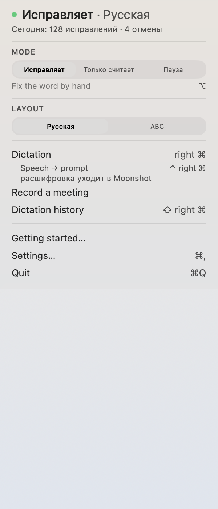

# iriz

Speak out loud and the text appears. Your Mac does the decoding, and nothing travels to somebody else's cloud.

[Русский](README.ru.md) · [中文](README.zh.md)

[](LICENSE) [](https://github.com/zarubinvibe/iriz/stargazers) [](https://github.com/zarubinvibe/iriz) [](https://github.com/zarubinvibe/athena#olympuz-family)

<p align="center"></p>

<!-- owner-welcome:start -->

> Hello. I am a lawyer who vibe-codes, and I type a great deal. I type fast, and it still eats so much of the day that by evening half of it turns out to have been typing.
>
> After trying a few tools I noticed something simple: I say things more precisely than I type them. Typing, I hunt for words. Speaking, I do not, the thought comes out whole, and the model on the other end understands me better. One thing stood in the way, privacy. So the line is drawn here: whatever has to stay mine is decoded on my own machine, and the only thing that leaves it is what I sent out myself, a translation or a task built from what I said.
>
> And the small thing this all started from: I forget to switch the language and type a sentence in the wrong layout. Here that repairs itself.
>
> — Filipp Zarubin

<!-- owner-welcome:end -->

## Contents

- [What This Is](#what-this-is)
- [Why It Helps](#why-it-helps)
- [The Main Advantage](#the-main-advantage)
- [How It Works](#how-it-works)
- [Quickstart](#quickstart)
- [Simple Comparison](#simple-comparison)
- [Simple Words](#simple-words)
- [Safety And Privacy](#safety-and-privacy)
- [Limits](#limits)
- [Star And Contribute](#star-and-contribute)

<!-- beginner-readme:start -->

## What This Is

This is a Mac app that types for you while you talk.

Here is how it goes. You press one key, speak in your normal voice, press it again. The text lands where the cursor was: in an email, in a chat, in a search field. Nothing to switch to, no separate window.

What sets it apart from similar apps is where the speech is decoded. Usually your voice travels to somebody's server, turns into text there and comes back. Here your Mac does the work, and the audio never leaves the machine.

**Why «iriz».** Iris was the messenger of the Greek gods and the rainbow — a bridge between the sky and the ground. She does not invent the message, she carries it whole. The app does exactly that: it takes what you said and moves it into text, adding nothing of its own.



It does more. It fixes a phrase typed in the wrong keyboard layout. Correct a word after pasting and the app offers to remember the replacement. It strips hesitations and repetitions. It splits a meeting or a court hearing recording by voice and puts the minutes next to the audio.


## Why It Helps

Anyone who writes for a living loses hours to typing. The same thought comes out faster and whole when spoken: typing, you hunt for words; speaking, you do not.

One thing gets in the way. Cloud dictation cleans speech better than anything local, but what you said leaves the machine: a client call, a draft, names and figures. For a doctor, a lawyer, a therapist, that trade never pays off.

So here your Mac does the decoding, and the app reaches the network only when you press the button.

## The Main Advantage

**Main advantage:** your Mac decodes the speech, and during dictation the network is closed by a switch in the code rather than a promise in the text.

**Why this is better:** The switch sits inside the recognition library and returns to its place even when a download fails. Documentation does not prove that: a script pins the set of networking symbols in the built binary and asks the kernel whether the running app holds a single socket.

## How It Works

Press the key, say your sentence, press again. The text lands where the cursor was blinking.

A glass drop sits at the bottom of the screen the whole time. While you are silent it stays small. Start talking and a wave runs inside it: that is the answer to «can it hear me».


Point at it with the mouse and the drop opens into a row of buttons: record, prompt, translate, language, history, settings. The language switches right there, a second before you speak — no need to walk to the settings for it.


If pasting did not work, nothing is lost: the same plate opens into a panel and you take the text from there.


<!-- workflow-diagram:start -->

<p align="center"></p>

<!-- workflow-diagram:end -->

| Stage | What happens |
|---|---|
| 1. Key | One key, the same one in every app |
| 2. Voice | You speak, a plate shows it is listening |
| 3. Decode | The Mac turns it into letters, on its own chip |
| 4. Text | The text lands where the cursor was blinking |

### Step 1: Press your key

By default it is the right Command key. You press it, and nothing else on the Mac has to change: no window to open, no field to focus first. If that key is already taken on your machine, you swap it during the walkthrough, not in a settings maze.

<p align="center"></p>

**You get:** a key that answers in the editor, the mail client and the terminal alike.

### Step 2: Say it out loud

A small plate appears near the cursor and its wave follows your voice, so you can see you are being heard rather than guess. The sound lives in memory only as long as it takes to decode it, and is never written to disk.

<p align="center"></p>

**You get:** a recording that exists for seconds and leaves nothing behind.

### Step 3: The Mac decodes it

Recognition runs on the Neural Engine of your Mac: seven seconds of speech take about a tenth of a second. Nothing is sent anywhere, and while dictation runs the recognition library keeps its downloader shut.

<p align="center"></p>

**You get:** a transcript that was never anywhere but your machine.

### Step 4: The text lands in the field

It goes into the field you were already in: an email, a chat, a terminal. If the field refuses it, the plate opens into a panel holding the whole text, and one click puts it on the clipboard. Nothing is lost while you reach for it.

<p align="center"></p>

**You get:** text in the field, or text you can still take from the panel.

## Quickstart

You need a Mac on macOS 14 or newer. Building from source also wants Xcode with Swift 6. Three doors from here, any of them works.

```bash
git clone https://github.com/zarubinvibe/iriz.git ~/iriz
cd ~/iriz
bash install.sh          # просто терминал, без единого агента
code .                   # или откройте папку в редакторе
claude                   # или пустите агента: он проведет установку разговором
```

Do not want to build? Take the ready disk image from Releases: open it, drag the icon onto Applications. No Git? Download [the ZIP](https://github.com/zarubinvibe/iriz/archive/refs/heads/main.zip), unpack it, and run the same command inside. First time? Open the project in Claude Code and run `/iriz-setup`: the install goes as a conversation, one question at a time, and nothing is installed without your yes.

Never done this before? [The onboarding](docs/ONBOARDING.md) walks the whole first run step by step and says what you see after every command.

**You get:** the installer says what this is, looks at what your machine is missing, runs the tree selfcheck, and names the next step. It installs nothing until you ask.

## Simple Comparison

| Choice | Best when | What you get | Where speech goes | Layout repair | Trade-off |
|---|---|---|---|---|---|
| **iriz** | You dictate work material and cannot hand it out | Layout, local dictation, speech into a task | Nowhere; the Mac decodes it | Yes, English and Russian | Russian first, no notarization yet |
| Doing it by hand | One short phrase, once | Full control over every letter | Nowhere | No | Long texts eat your evening |
| Punto Switcher | Layout only | Years of layout repair | Nowhere | Yes | No dictation at all |
| macOS built-in dictation | An occasional sentence | It is already installed | Apple, unless the offline model is on | No | Weak on terms, no task building |
| Wispr Flow and the like | Rambling speech into smooth text | The best cleanup there is | Their server | No | Your client names travel with it |
| Local Whisper apps | Dictation without a cloud | Also decodes on your machine | Nowhere | No | No layout repair, no task from speech |

## Simple Words

| Word | Simple meaning |
|---|---|
| Repository | The project folder that Git stores and versions |
| Terminal | The window where you type commands |
| Command | One instruction you give the computer |
| Branch | A separate line of changes that does not touch `main` |
| Pull Request | A request to review your change and accept it |
| Neural Engine | A separate part of the Apple chip for neural networks: it keeps recognition fast and the machine cool |
| Speech model | The weight files that turn sound into letters. It lives on your disk and downloads once |

## Safety And Privacy

- Audio is never saved. It lives exactly as long as it takes to decode what you said.
- The screen is not read. No ScreenCaptureKit, no window captures.
- Other apps' fields are not read: the permission is there to learn whether a field accepts text, not to take text out of it.
- Where you dictated is not recorded. Otherwise the disk would collect metadata about who you work with and when.
- The clipboard is put back after the paste.
- Transcripts sit under 0700 and 0600 and stay on your disk.

One thing goes out, and only on your button: the one-time speech model download. Prompt mode is off by default, and switching it on means agreeing that the transcript reaches the agent you picked.

## Limits

Status: working. The author dictates with it every day.

- macOS 14 and newer only. No Windows, no Linux, no iPad.
- Automatic layout switching covers the English and Russian pair.
- No notarization yet: a downloaded build opens through a right-click the first time.
- The universal binary carries an Intel slice, but the author owns no Intel Mac and never verified it there.

Deeper: [the step-by-step walkthrough with a frame of every surface](docs/ONBOARDING.md), [how to help](CONTRIBUTING.md), [security](SECURITY.md).

## Star And Contribute

Useful? Give iriz a star: [https://github.com/zarubinvibe/iriz](https://github.com/zarubinvibe/iriz). It takes a second and it decides whether other people ever find the project.

Want to change something? The path is short: fork the repository, create a branch, commit your change, push the branch, then open a Pull Request. Do not push directly to `main`; the release gate rejects it.

Found a problem instead? Open an issue at [https://github.com/zarubinvibe/iriz/issues](https://github.com/zarubinvibe/iriz/issues) and say what you ran and what happened.

<!-- beginner-readme:end -->

<!-- pantheon-family:start -->
## Olympuz family

This is one of the public [Olympuz projects](https://github.com/zarubinvibe/athena#olympuz-family). Each row opens the repository or downloads its source as a ZIP.

| Type | Name | What it does | Source |
|---|---|---|---|
| project | Athena | Portable agent OS that restores a complete Claude and Codex setup on a new Mac. | [Repository](https://github.com/zarubinvibe/athena) · [ZIP](https://github.com/zarubinvibe/athena/archive/refs/heads/main.zip) |
| project | Helioz | 24/7 agent work conveyor with verified completion markers and goal-based overnight decisions. | [Repository](https://github.com/zarubinvibe/helioz) · [ZIP](https://github.com/zarubinvibe/helioz/archive/refs/heads/main.zip) |
| project | Mnemazine | Local-first memory system that turns raw inputs into verified reusable knowledge. | [Repository](https://github.com/zarubinvibe/mnemazine) · [ZIP](https://github.com/zarubinvibe/mnemazine/archive/refs/heads/main.zip) |
| project | Themiz | Multi-agent assistant for Russian litigation with local OCR and review by a five-jurist council. | [Repository](https://github.com/zarubinvibe/themiz) · [ZIP](https://github.com/zarubinvibe/themiz/archive/refs/heads/main.zip) |
| project | Zeuz | Factory that turns an idea into a governed multi-agent workflow with gates, observability, and replay. | [Repository](https://github.com/zarubinvibe/zeuz) · [ZIP](https://github.com/zarubinvibe/zeuz/archive/refs/heads/main.zip) |
| project | Lynceuz | Collects public web evidence at zero cost and stops with an honest reason when the safe routes end. | [Repository](https://github.com/zarubinvibe/lynceuz) · [ZIP](https://github.com/zarubinvibe/lynceuz/archive/refs/heads/main.zip) |
| project | Iriz | macOS menu-bar dictation that decodes speech on your own Mac, fixes wrong keyboard layouts, and turns dictation into a ready task for an agent. | [Repository](https://github.com/zarubinvibe/iriz) · [ZIP](https://github.com/zarubinvibe/iriz/archive/refs/heads/main.zip) |
| project | Mantoz | Puts an idea in front of five hundred people who do not exist, then shows how each group answered. | [Repository](https://github.com/zarubinvibe/mantoz) · [ZIP](https://github.com/zarubinvibe/mantoz/archive/refs/heads/main.zip) |
| project | Koiz | A single lesson base for every project. Each failure is taken down to its cause, and the cause stays open until a hook, a gate or a test closes it. | [Repository](https://github.com/zarubinvibe/koiz) · [ZIP](https://github.com/zarubinvibe/koiz/archive/refs/heads/main.zip) |
<!-- pantheon-family:end -->

## License

MIT. See [LICENSE](LICENSE).
