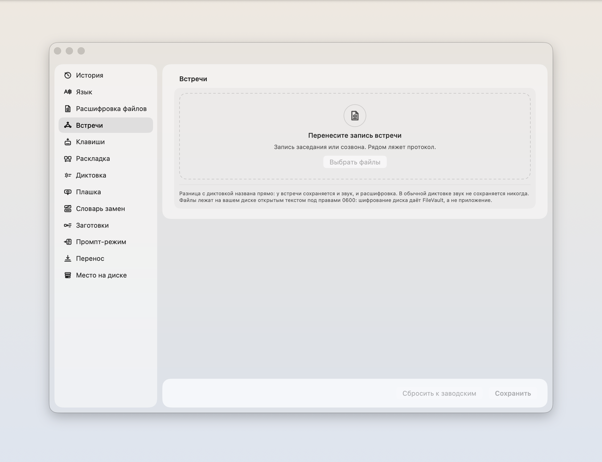
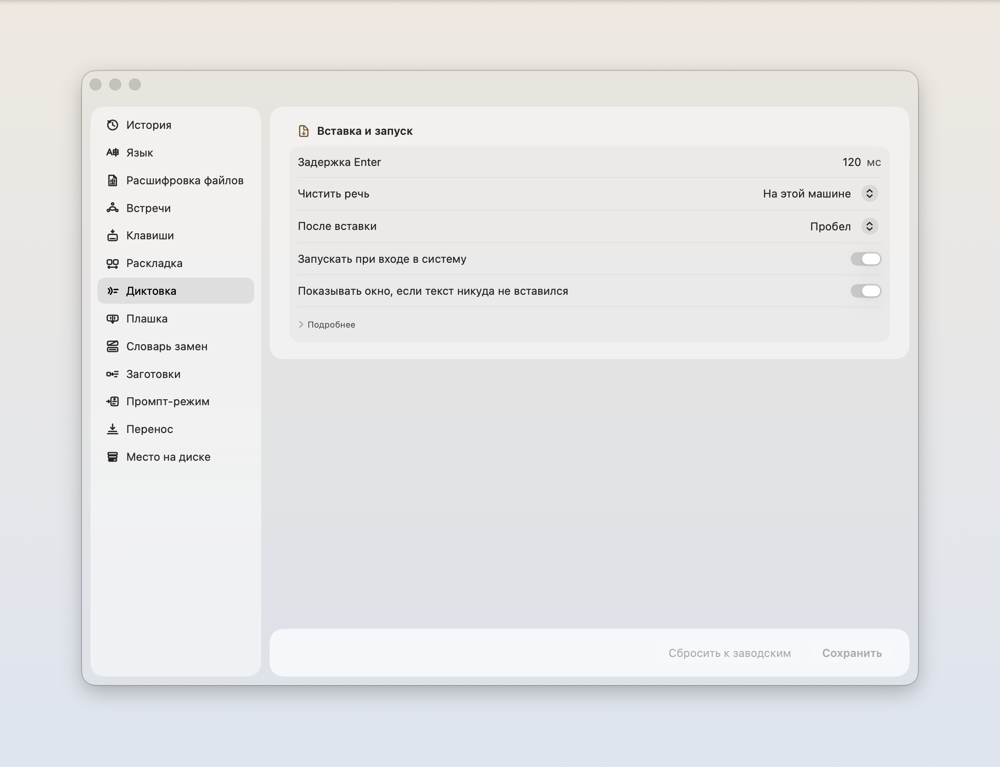

# iriz

Говори вслух, на экране появляется текст. Речь разбирает твой Мак. Передачу текста агенту ты разрешаешь отдельно.

[](https://github.com/zarubinvibe/iriz/releases/latest/download/iriz-macos-arm64.dmg)

Apple Silicon · macOS 14+ · Модель скачивается отдельно: около 500 МБ

[Установка и первая диктовка](docs/DOWNLOAD.ru.md) · [Что изменилось](https://github.com/zarubinvibe/iriz/releases/latest)

Самоподпись, без нотаризации Apple. Этот выпуск не поддерживает Intel.

[English](README.md) · [中文](README.zh.md)

[](LICENSE) [](https://github.com/zarubinvibe/iriz/stargazers) [](https://github.com/zarubinvibe/iriz) [](https://github.com/zarubinvibe/athena#olympuz-family)

<p align="center"></p>

<!-- owner-welcome:start -->

> Привет. Я юрист и вайб-кодер, и печатаю я очень много. Печатаю быстро, но времени это все равно съедает столько, что к вечеру половина дня оказывается набором текста.
>
> Попробовав несколько инструментов, я понял простую вещь: голосом я говорю точнее, чем печатаю. Когда печатаю, я подбираю слова. Когда говорю, не подбираю, и мысль выходит целой, а модель на том конце понимает меня лучше. Мешала одна вещь - приватность. Поэтому здесь она разведена по границе: то, что должно остаться моим, разбирается только на моей машине, а наружу уходит лишь то, что я сам туда отправил, вроде перевода или сборки задания.
>
> И мелочь, из которой все начиналось: я забываю переключить язык и набираю фразу не в той раскладке. Тут это чинится само.
>
> — Филипп Зарубин

<!-- owner-welcome:end -->

## Оглавление

- [Что это](#что-это)
- [Зачем это нужно](#зачем-это-нужно)
- [Главное преимущество](#главное-преимущество)
- [Как это работает](#как-это-работает)
- [Быстрый старт](#быстрый-старт)
- [Простое сравнение](#простое-сравнение)
- [Простые слова](#простые-слова)
- [Безопасность и приватность](#безопасность-и-приватность)
- [Ограничения](#ограничения)
- [Звезда и вклад](#звезда-и-вклад)

<!-- beginner-readme:start -->

## Что это

Это программа для Мака, которая печатает за тебя, пока ты говоришь.

Работает так. Ты нажимаешь одну клавишу, говоришь обычным голосом, нажимаешь еще раз. Текст встает туда, где стоял курсор: в письмо, в чат, в поле поиска. Никуда переключаться не нужно, отдельного окна нет.

Главное отличие от похожих программ в том, где разбирается речь. Обычно голос уезжает на чужой сервер, там превращается в текст и возвращается. Здесь считает твой Мак, и звук с машины не уходит.

**Почему «iriz».** Ирида у греков - вестница богов и радуга, мост между небом и землей. Она не сочиняет послание, а доносит его целым. Отсюда и задача программы: переносить речь в текст. Распознавание может ошибаться, поэтому результат нужно проверить.


Умеет и другое. Чинит фразу, набранную не в той раскладке. Поправишь слово после вставки, и программа предложит запомнить замену. В обычной диктовке может убрать запинки и повторы.

У встреч другой порядок: исходная расшифровка не редактируется, звук сохраняется рядом. DOCX содержит сначала протокол, затем полную доступную расшифровку с новой страницы; рядом лежат JSON и список уточнений. Заполнение решений и поручений через выбранного агента требует отдельного согласия на передачу текста. Неизвестные сведения отмечаются явно, результат остается черновиком. [Как обработать встречу](docs/MEETINGS.md).




## Зачем это нужно

Кто много пишет по работе, тратит на набор часы. Голосом та же мысль выходит быстрее и целее: печатая, человек подбирает слова, говоря, не подбирает.

Мешает одно. Облачная диктовка чистит речь лучше любой местной, но наружу уезжает сказанное: разговор с клиентом, черновик документа, имена и суммы. Для врача, юриста, психолога такой обмен не окупается ничем.

Поэтому тут разбирает Мак, а в сеть программа ходит только по твоей кнопке.


## Главное преимущество

**Главное преимущество:** речь распознается на твоем Маке, без передачи аудио облачному распознавателю.

**Почему это лучше:** Во время распознавания библиотека держит свой загрузчик моделей выключенным. Этот режим не заменяет системный межсетевой экран: загрузка моделей и CLI-агенты обращаются к сети отдельно.

## Как это работает

Нажимаешь клавишу, говоришь фразу, нажимаешь еще раз. Текст встает туда, где мигал курсор.

Внизу экрана все это время висит стеклянная капля. Пока ты молчишь, она маленькая. Заговоришь - внутри бежит волна: это и есть ответ на вопрос «слышит ли меня».


Наведи на нее мышь - капля раскроется в ряд кнопок: запись, промпт, перевод, язык, история, настройки. Язык переключается здесь же, за секунду до того, как заговорить, и ходить за этим в настройки незачем.


Если вставить не удалось, ничего не потеряно: та же плашка раскроется в панель, и текст можно забрать оттуда.



<!-- workflow-diagram:start -->

<p align="center"></p>

<!-- workflow-diagram:end -->

| Этап | Что происходит |
|---|---|
| 1. Клавиша | Одна клавиша, и та же самая в любой программе |
| 2. Голос | Ты говоришь, и плашка показывает, что слышит |
| 3. Разбор | Мак превращает сказанное в буквы своим же чипом |
| 4. Текст | Текст встает туда, где мигал курсор |

### Шаг 1: Нажмите свою клавишу

По умолчанию это правый Command. Ты нажимаешь ее, и больше на Маке менять нечего: ни окна открывать, ни курсор куда-то ставить заранее. Если клавиша у тебя занята, поменять ее можно прямо в знакомстве, а не искать в настройках.

<p align="center"></p>

**Что получится:** клавиша, которая отвечает и в редакторе, и в почте, и в терминале.

### Шаг 2: Скажите вслух

Рядом с курсором появляется небольшая плашка, ее волна идет за твоим голосом. В обычной диктовке звук живет в памяти на время распознавания, запись не сохраняется. Записи встреч хранятся отдельно, в архиве.

<p align="center"></p>

**Что получится:** надиктованный текст без сохраненного аудиофайла в режиме обычной диктовки.

### Шаг 3: Мак разбирает сказанное

Распознавание идет на Neural Engine твоего Мака: семь секунд речи разбираются примерно за десятую долю секунды. Аудио обрабатывается локально, загрузчик самой библиотеки распознавания выключен. Дальнейшая обработка текста агентом требует твоего согласия.

<p align="center"></p>

**Что получится:** локальная расшифровка; передать ее агенту ты решаешь отдельно.

### Шаг 4: Текст встает в поле

Он попадает в исходное поле: письмо, чат, терминал. Если поле его не приняло, плашка раскрывается в панель с целым текстом, и один щелчок кладет его в буфер. Пока ты до него тянешься, он никуда не денется.

<p align="center"></p>

**Что получится:** текст в поле или текст, который еще можно забрать из панели.

## Быстрый старт

[Скачай DMG для macOS](https://github.com/zarubinvibe/iriz/releases/latest/download/iriz-macos-arm64.dmg), открой и перетащи iriz в Applications. Нужен Мак с Apple Silicon на macOS 14 или новее. Xcode и терминал не нужны.

Открой iriz и нажми «Скачать и установить Parakeet» в знакомстве. На следующих шагах выдай разрешения. Загрузка займет около 500 МБ. Дождись готовности, поставь курсор в текстовое поле и попробуй клавишу диктовки.

[Установка, восстановление модели и обновления](docs/DOWNLOAD.ru.md). Для сборки из исходников используй проверенный Xcode 26.6 (macOS 26 SDK, Swift 6.3.3). Ниже команды и другие способы установки.

```bash
git clone https://github.com/zarubinvibe/iriz.git ~/iriz
cd ~/iriz
bash install.sh          # просто терминал, без единого агента
code .                   # или открой папку в редакторе
claude                   # или пусти агента: он проведет установку разговором
```

Нет Git? Скачай [ZIP с исходниками](https://github.com/zarubinvibe/iriz/archive/refs/heads/main.zip), распакуй и запусти в нем тот же установщик. Или открой проект в Claude Code и запусти `/iriz-setup`: агент проведет установку по шагам и спросит перед изменениями.

Делаешь это впервые? [Онбординг](docs/ONBOARDING.ru.md) проводит весь первый запуск по шагам и говорит, что видно после каждой команды.

**Что получится:** установщик объясняет, что это, смотрит, чего не хватает на машине, гоняет самопроверку дерева и называет следующий шаг. Ничего не ставит, пока ты не попросишь.

## Простое сравнение

| Вариант | Когда подходит | Что получаешь | Куда уходит речь | Чинит раскладку | Минус |
|---|---|---|---|---|---|
| **iriz** | Диктуешь рабочее и отдать не можешь | Раскладка, местная диктовка, речь в задание | Аудио разбирает Мак; текст агенту только с согласия | Да, английский и русский | Русский первым, нотаризации пока нет |
| Делать руками | Одна короткая фраза, один раз | Полный контроль над каждой буквой | Никуда | Нет | Длинный текст съедает вечер |
| Punto Switcher | Нужна только раскладка | Годы работы над раскладкой | Никуда | Да | Диктовки нет вовсе |
| Встроенная диктовка macOS | Изредка одна фраза | Уже стоит на машине | В Apple, если не включена офлайн-модель | Нет | Слаба на терминах, задание не собирает |
| Wispr Flow и подобные | Сбивчивая речь в гладкий текст | Лучшая чистка речи | На их сервер | Нет | Имена доверителей уезжают вместе с текстом |
| Местная диктовка на Whisper | Диктовать без облака | Тоже считает у тебя | Никуда | Нет | Раскладку не чинит, задание из речи не собирает |

## Простые слова

| Слово | Простое значение |
|---|---|
| Repository | Папка проекта, которую хранит и версионирует Git |
| Terminal | Окно, куда ты вводишь команды |
| Command | Одна инструкция, которую ты даешь компьютеру |
| Branch | Отдельная линия изменений, которая не трогает `main` |
| Pull Request | Просьба проверить твое изменение и принять его |
| Neural Engine | Отдельный кусок процессора Apple под нейросети: держит распознавание быстрым и не греет машину |
| Модель распознавания | Файлы весов, по которым звук превращается в буквы. Живет у тебя на диске, скачивается один раз |

## Безопасность и приватность

- Обычная диктовка не сохраняет звук. У встреч копия записи остается в архиве iriz.
- Экран не читается. Ни ScreenCaptureKit, ни снимков окон.
- Чтобы предложить исправления после диктовки, iriz читает текст поля в фокусе через Accessibility. Полное содержимое поля не сохраняется.
- Место диктовки не записывается. Иначе на диске копились бы метаданные о том, с кем и когда ты работаешь.
- Буфер обмена возвращается на место после вставки.
- Сохраненные расшифровки доступны владельцу: права 0700 у папок и 0600 у файлов. Это открытый текст, приложение его не шифрует.

Модели распознавания и дополнительные модели голосов скачиваются по отдельным кнопкам; звук и текст при загрузке не передаются. Промпт-режим, перевод и агентская очистка передают текст выбранному CLI после твоего согласия. Для заполнения протокола приложение отдельно спрашивает разрешение передать всю расшифровку, без аудио. Адрес задают настройки CLI: даже локальная программа может обращаться к удаленному серверу. Возможны расходы по тарифу провайдера.

## Ограничения

Статус: работает. Автор диктует им каждый день.

- Этот выпуск рассчитан на Apple Silicon и macOS 14 или новее. Intel не проверен; Windows, Linux и iPad не поддерживаются.
- Раскладка исправляется для пары английский и русский. Интерфейс доступен на русском, английском и китайском.
- У приложения самоподпись, нотаризации Apple нет. Предупреждение о первом запуске есть в инструкции скачивания.
- Модель Parakeet скачивается отдельно, занимает около 500 МБ и не распознает китайскую речь. У других моделей свой набор языков.
- Обновление ручное: скачай новый DMG, закрой iriz и замени приложение. Модели и история хранятся вне его пакета.

Глубже: [пошаговое знакомство с кадрами каждой поверхности](docs/ONBOARDING.ru.md), [как помочь](CONTRIBUTING.ru.md), [безопасность](SECURITY.ru.md).

## Звезда и вклад

Пригодилось? Поставь iriz звезду: [https://github.com/zarubinvibe/iriz](https://github.com/zarubinvibe/iriz). Это секунда, а от нее зависит, найдут ли проект другие люди.

Хочешь что-то поправить? Путь короткий: сделай fork, заведи ветку, оформи commit, отправь push и открой Pull Request. Не отправляй push прямо в `main`.

Нашел ошибку? Заведи issue на [https://github.com/zarubinvibe/iriz/issues](https://github.com/zarubinvibe/iriz/issues) и напиши, что запускал и что получилось.

<!-- beginner-readme:end -->

<!-- pantheon-family:start -->
## Семья Olympuz

Это один из публичных [проектов семьи Olympuz](https://github.com/zarubinvibe/athena#olympuz-family). Из таблицы можно открыть репозиторий или сразу скачать исходники в ZIP.

| Тип | Название | Что внутри | Чем помогает этому дому | Скачать |
|---|---|---|---|---|
| проект | Athena | Переносимая агентная ОС: разворачивает рабочую среду Claude и Codex на новом Mac. | Разворачивает рабочую среду агента на новой машине: правила, скиллы, хуки — за один прогон. | [Репозиторий](https://github.com/zarubinvibe/athena) · [ZIP](https://github.com/zarubinvibe/athena/archive/refs/heads/main.zip) |
| проект | Helioz | Конвейер работы агентов 24/7 с проверяемыми отметками готовности и ночными решениями по цели владельца. | Гоняет работу агентов круглосуточно и закрывает каждую задачу проверяемой отметкой. | [Репозиторий](https://github.com/zarubinvibe/helioz) · [ZIP](https://github.com/zarubinvibe/helioz/archive/refs/heads/main.zip) |
| проект | Mnemazine | Локальная система памяти: превращает сырье в проверенные знания для повторного использования. | Превращает сырье — скриншоты, PDF, ссылки — в проверенные заметки базы знаний. | [Репозиторий](https://github.com/zarubinvibe/mnemazine) · [ZIP](https://github.com/zarubinvibe/mnemazine/archive/refs/heads/main.zip) |
| проект | Themiz | Многоагентный помощник по российским судебным делам с локальным OCR и советом из пяти юристов. | Ведет российские судебные дела многоагентно, с локальным хранением материалов. | [Репозиторий](https://github.com/zarubinvibe/themiz) · [ZIP](https://github.com/zarubinvibe/themiz/archive/refs/heads/main.zip) |
| проект | Zeuz | Фабрика многоагентных workflow: собирает систему с правилами, гейтами, наблюдаемостью и replay. | Собирает многоагентный workflow с правилами, воротами, наблюдаемостью и повтором прогона. | [Репозиторий](https://github.com/zarubinvibe/zeuz) · [ZIP](https://github.com/zarubinvibe/zeuz/archive/refs/heads/main.zip) |
| проект | Lynceuz | Собирает доказательства из открытого веба за ноль рублей и честно останавливается, когда безопасные пути кончились. | Собирает доказательства из открытого веба бесплатно и честно останавливается на границе. | [Репозиторий](https://github.com/zarubinvibe/lynceuz) · [ZIP](https://github.com/zarubinvibe/lynceuz/archive/refs/heads/main.zip) |
| проект | Iriz | Диктовка в строке меню macOS: речь разбирается на твоем Маке, раскладка чинится сама, надиктовка превращается в готовое задание для агента. | Диктовка в строке меню macOS: речь разбирается на твоем Маке, раскладка чинится сама. | [Репозиторий](https://github.com/zarubinvibe/iriz) · [ZIP](https://github.com/zarubinvibe/iriz/archive/refs/heads/main.zip) |
| проект | Mantoz | Ставит идею перед пятьюстами людьми, которых не существует, и показывает, как ответила каждая группа. | Ставит идею перед сотнями сгенерированных людей до того, как ее увидят живые. | [Репозиторий](https://github.com/zarubinvibe/mantoz) · [ZIP](https://github.com/zarubinvibe/mantoz/archive/refs/heads/main.zip) |
| проект | Koiz | Одна база уроков на все проекты. Каждый провал доводится до причины, и причина висит открытой, пока ее не закроет хук, ворота или тест. | Держит одну базу уроков на все проекты и требует механизм, а не обещание. | [Репозиторий](https://github.com/zarubinvibe/koiz) · [ZIP](https://github.com/zarubinvibe/koiz/archive/refs/heads/main.zip) |
<!-- pantheon-family:end -->

## Лицензия

MIT. Текст в файле [LICENSE](LICENSE).
