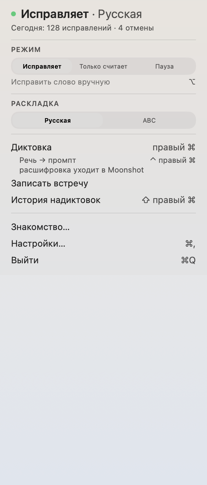
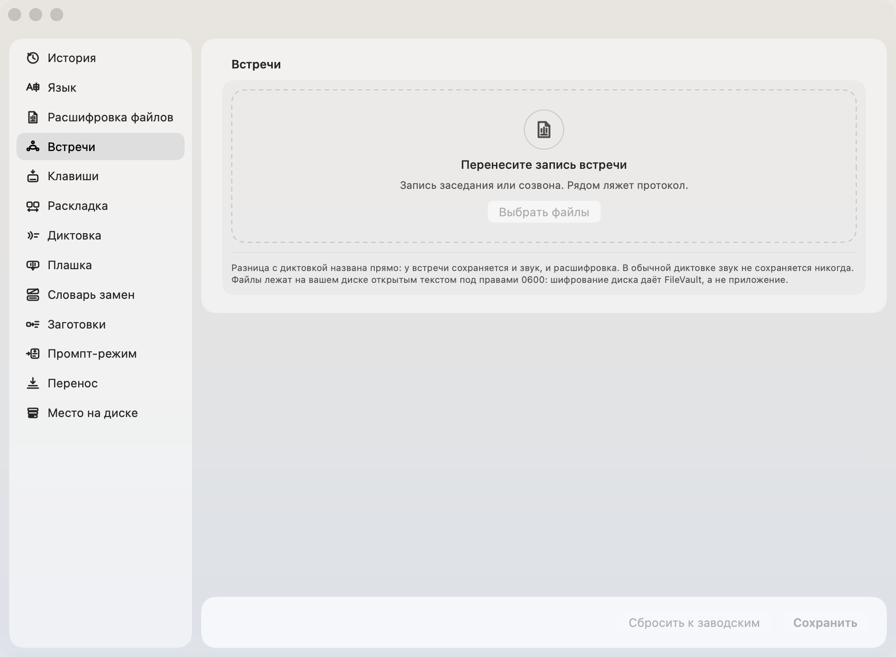
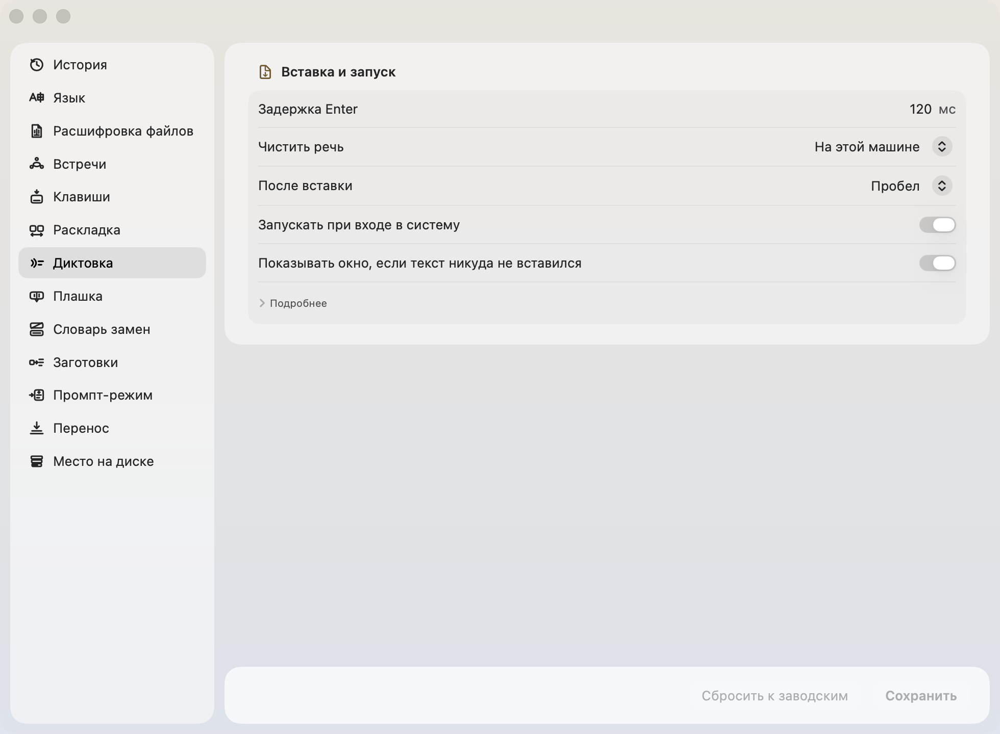

# iriz

Говорите вслух, на экране появляется текст. Разбирает речь сам Мак, ничего не улетает в чужое облако.

[English](README.md) · [中文](README.zh.md)

[](LICENSE) [](https://github.com/zarubinvibe/iriz/stargazers) [](https://github.com/zarubinvibe/iriz) [](https://github.com/zarubinvibe/athena#olympuz-family)

<p align="center"></p>

<!-- owner-welcome:start -->

> Привет. Я юрист и вайб-кодер, и печатаю я очень много. Печатаю быстро, но времени это все равно съедает столько, что к вечеру половина дня оказывается набором текста.
>
> Попробовав несколько инструментов, я понял простую вещь: голосом я говорю точнее, чем печатаю. Когда печатаю, я подбираю слова. Когда говорю, не подбираю, и мысль выходит целой, а модель на том конце понимает меня лучше. Мешала одна вещь - приватность. Поэтому здесь она разведена по границе: то, что должно остаться моим, разбирается только на моей машине, а наружу уходит лишь то, что я сам туда отправил, вроде перевода или сборки задания.
>
> И мелочь, из которой все начиналось: я забываю переключить язык и набираю фразу не в той раскладке. Тут это чинится само.
>
> — Филипп Зарубин

<!-- owner-welcome:end -->

## Оглавление

- [Что это](#что-это)
- [Зачем это нужно](#зачем-это-нужно)
- [Главное преимущество](#главное-преимущество)
- [Как это работает](#как-это-работает)
- [Быстрый старт](#быстрый-старт)
- [Простое сравнение](#простое-сравнение)
- [Простые слова](#простые-слова)
- [Безопасность и приватность](#безопасность-и-приватность)
- [Ограничения](#ограничения)
- [Звезда и вклад](#звезда-и-вклад)

<!-- beginner-readme:start -->

## Что это

Это программа для Мака, которая печатает за вас, пока вы говорите.

Работает так. Вы нажимаете одну клавишу, говорите обычным голосом, нажимаете еще раз. Текст встает туда, где стоял курсор: в письмо, в чат, в поле поиска. Никуда переключаться не нужно, отдельного окна нет.

Главное отличие от похожих программ в том, где разбирается речь. Обычно голос уезжает на чужой сервер, там превращается в текст и возвращается. Здесь считает ваш Мак, и звук с машины не уходит.

**Почему «iriz».** Ирида у греков — вестница богов и радуга, мост между небом и землей. Она не сочиняет послание, а доносит его целым. Программа делает ровно это: берет сказанное и переносит в текст, ничего не добавляя от себя.



Умеет и другое. Чинит фразу, набранную не в той раскладке. Поправите слово после вставки, и программа предложит запомнить замену. Уберет из речи запинки и повторы. Разберет запись встречи или судебного заседания по голосам, а рядом со звуком положит готовый протокол.



## Зачем это нужно

Кто много пишет по работе, тратит на набор часы. Голосом та же мысль выходит быстрее и целее: печатая, человек подбирает слова, говоря, не подбирает.

Мешает одно. Облачная диктовка чистит речь лучше любой местной, но наружу уезжает то, что вы сказали: разговор с клиентом, черновик документа, имена и суммы. Для врача, юриста, психолога такой обмен не окупается ничем.

Поэтому тут разбирает Мак, а в сеть программа ходит только по вашей кнопке.

## Главное преимущество

**Главное преимущество:** речь разбирает ваш Мак, и во время диктовки сеть закрыта рубильником в коде, а не обещанием в тексте.

**Почему это лучше:** Рубильник стоит внутри библиотеки распознавания и возвращается на место даже когда загрузка падает. Проверяет это не документация: скрипт пинует набор сетевых символов в собранном бинарнике и спрашивает у ядра, есть ли у работающего приложения хоть один сокет.

## Как это работает

Нажали клавишу, сказали фразу, нажали еще раз. Текст встает туда, где мигал курсор.

Внизу экрана все это время висит стеклянная капля. Пока вы молчите, она маленькая. Заговорили — внутри бежит волна: это и есть ответ на вопрос «слышит ли меня».


Наведите на нее мышь — капля раскроется в ряд кнопок: запись, промпт, перевод, язык, история, настройки. Язык переключается здесь же, за секунду до того, как заговорить, и ходить за этим в настройки незачем.


Если вставить не удалось, ничего не потеряно: та же плашка раскроется в панель, и текст можно забрать оттуда.



<!-- workflow-diagram:start -->

<p align="center"></p>

<!-- workflow-diagram:end -->

| Этап | Что происходит |
|---|---|
| 1. Клавиша | Одна клавиша, и та же самая в любой программе |
| 2. Голос | Вы говорите, и плашка показывает, что слышит |
| 3. Разбор | Мак превращает сказанное в буквы своим же чипом |
| 4. Текст | Текст встает туда, где мигал курсор |

### Шаг 1: Нажмите свою клавишу

По умолчанию это правый Command. Вы нажимаете ее, и больше на Маке менять нечего: ни окна открывать, ни курсор куда-то ставить заранее. Если клавиша у вас занята, поменять ее можно прямо в знакомстве, а не искать в настройках.

<p align="center"></p>

**Что получится:** клавиша, которая отвечает и в редакторе, и в почте, и в терминале.

### Шаг 2: Скажите вслух

Рядом с курсором появляется небольшая плашка, ее волна идет за вашим голосом, и видно, что вас слышат, а не приходится гадать. Звук живет в памяти ровно столько, сколько нужно на разбор, и на диск не попадает.

<p align="center"></p>

**Что получится:** запись, которая существует секунды и не оставляет следа.

### Шаг 3: Мак разбирает сказанное

Распознавание идет на Neural Engine вашего Мака: семь секунд речи разбираются примерно за десятую долю секунды. Никуда ничего не отправляется, а пока идет диктовка, загрузчик внутри библиотеки распознавания закрыт рубильником.

<p align="center"></p>

**Что получится:** расшифровка, которая нигде, кроме вашей машины, не была.

### Шаг 4: Текст встает в поле

Он попадает в то поле, в котором вы и были: письмо, чат, терминал. Если поле его не приняло, плашка раскрывается в панель с целым текстом, и один щелчок кладет его в буфер. Пока вы до него тянетесь, он никуда не денется.

<p align="center"></p>

**Что получится:** текст в поле или текст, который еще можно забрать из панели.

## Быстрый старт

Нужен Мак на macOS 14 или новее. Для сборки из исходников еще Xcode со Swift 6. Дверей три, годится любая.

```bash
git clone https://github.com/zarubinvibe/iriz.git ~/iriz
cd ~/iriz
bash install.sh          # просто терминал, без единого агента
code .                   # или откройте папку в редакторе
claude                   # или пустите агента: он проведет установку разговором
```

Не хотите собирать - возьмите готовый образ в разделе Releases: открыли, перетащили значок в Applications. Нет Git? Скачайте [ZIP](https://github.com/zarubinvibe/iriz/archive/refs/heads/main.zip), распакуйте и запустите в нем ту же команду. Первый раз? Откройте проект в Claude Code и запустите `/iriz-setup`: установка пройдет разговором, по одному вопросу, и ничего не поставится без вашего «да».

Делаете это впервые? [Онбординг](docs/ONBOARDING.ru.md) проводит весь первый запуск по шагам и говорит, что видно после каждой команды.

**Что получится:** установщик объясняет, что это, смотрит, чего не хватает на машине, гоняет самопроверку дерева и называет следующий шаг. Ничего не ставит, пока вы не попросите.

## Простое сравнение

| Вариант | Когда подходит | Что получаете | Куда уходит речь | Чинит раскладку | Минус |
|---|---|---|---|---|---|
| **iriz** | Диктуете рабочее и отдать не можете | Раскладка, местная диктовка, речь в задание | Никуда, разбирает Мак | Да, английский и русский | Русский первым, нотаризации пока нет |
| Делать руками | Одна короткая фраза, один раз | Полный контроль над каждой буквой | Никуда | Нет | Длинный текст съедает вечер |
| Punto Switcher | Нужна только раскладка | Годы работы над раскладкой | Никуда | Да | Диктовки нет вовсе |
| Встроенная диктовка macOS | Изредка одна фраза | Уже стоит на машине | В Apple, если не включена офлайн-модель | Нет | Слаба на терминах, задание не собирает |
| Wispr Flow и подобные | Сбивчивая речь в гладкий текст | Лучшая чистка речи | На их сервер | Нет | Имена доверителей уезжают вместе с текстом |
| Местная диктовка на Whisper | Диктовать без облака | Тоже считает у вас | Никуда | Нет | Раскладку не чинит, задание из речи не собирает |

## Простые слова

| Слово | Простое значение |
|---|---|
| Repository | Папка проекта, которую хранит и версионирует Git |
| Terminal | Окно, куда вы вводите команды |
| Command | Одна инструкция компьютеру |
| Branch | Отдельная линия изменений, которая не трогает `main` |
| Pull Request | Просьба проверить ваше изменение и принять его |
| Neural Engine | Отдельный кусок процессора Apple под нейросети: держит распознавание быстрым и не греет машину |
| Модель распознавания | Файлы весов, по которым звук превращается в буквы. Живет у вас на диске, скачивается один раз |

## Безопасность и приватность

- Звук нигде не сохраняется: он живет ровно столько, сколько нужно, чтобы разобрать сказанное.
- Экран не читается. Ни ScreenCaptureKit, ни снимков окон.
- Чужие поля не читаются: доступ нужен, чтобы понять, можно ли в поле писать, а не чтобы забрать оттуда текст.
- Куда вы диктовали, не записывается. Иначе на диске копились бы метаданные о том, с кем и когда вы работаете.
- Буфер обмена возвращается на место после вставки.
- Расшифровки лежат под правами 0700 и 0600 и остаются на вашем диске.

В сеть уходит одно и по вашей кнопке: разовая загрузка модели распознавания. Промпт-режим выключен по умолчанию, и включая его, вы соглашаетесь, что расшифровка уйдет выбранному агенту.

## Ограничения

Статус: работает. Автор диктует им каждый день.

- Только macOS 14 и новее. Ни Windows, ни Linux, ни iPad.
- Автопереключение раскладки работает для пары английский и русский.
- Нотаризации пока нет: первый запуск скачанной сборки открывается правым щелчком.
- Универсальный бинарник содержит срез под Intel, но живого Intel-Мака у автора нет, и проверено это не было.

Глубже: [пошаговое знакомство с кадрами каждой поверхности](docs/ONBOARDING.ru.md), [как помочь](CONTRIBUTING.ru.md), [безопасность](SECURITY.ru.md).

## Звезда и вклад

Пригодилось? Поставьте iriz звезду: [https://github.com/zarubinvibe/iriz](https://github.com/zarubinvibe/iriz). Это секунда, а от нее зависит, найдут ли проект другие люди.

Хотите что-то поправить? Путь короткий: сделайте fork, заведите ветку, оформите commit, отправьте push и откройте Pull Request. Не отправляйте push прямо в `main`: релизный gate его отклонит.

Нашли ошибку? Заведите issue на [https://github.com/zarubinvibe/iriz/issues](https://github.com/zarubinvibe/iriz/issues) и напишите, что запускали и что получилось.

<!-- beginner-readme:end -->

<!-- pantheon-family:start -->
## Семья Olympuz

Это один из публичных [проектов семьи Olympuz](https://github.com/zarubinvibe/athena#olympuz-family). Из таблицы можно открыть репозиторий или сразу скачать исходники в ZIP.

| Тип | Название | Что внутри | Скачать |
|---|---|---|---|
| проект | Athena | Переносимая агентная ОС: разворачивает рабочую среду Claude и Codex на новом Mac. | [Репозиторий](https://github.com/zarubinvibe/athena) · [ZIP](https://github.com/zarubinvibe/athena/archive/refs/heads/main.zip) |
| проект | Helioz | Конвейер работы агентов 24/7 с проверяемыми отметками готовности и ночными решениями по цели владельца. | [Репозиторий](https://github.com/zarubinvibe/helioz) · [ZIP](https://github.com/zarubinvibe/helioz/archive/refs/heads/main.zip) |
| проект | Mnemazine | Локальная система памяти: превращает сырье в проверенные знания для повторного использования. | [Репозиторий](https://github.com/zarubinvibe/mnemazine) · [ZIP](https://github.com/zarubinvibe/mnemazine/archive/refs/heads/main.zip) |
| проект | Themiz | Многоагентный помощник по российским судебным делам с локальным OCR и советом из пяти юристов. | [Репозиторий](https://github.com/zarubinvibe/themiz) · [ZIP](https://github.com/zarubinvibe/themiz/archive/refs/heads/main.zip) |
| проект | Zeuz | Фабрика многоагентных workflow: собирает систему с правилами, гейтами, наблюдаемостью и replay. | [Репозиторий](https://github.com/zarubinvibe/zeuz) · [ZIP](https://github.com/zarubinvibe/zeuz/archive/refs/heads/main.zip) |
| проект | Lynceuz | Собирает доказательства из открытого веба за ноль рублей и честно останавливается, когда безопасные пути кончились. | [Репозиторий](https://github.com/zarubinvibe/lynceuz) · [ZIP](https://github.com/zarubinvibe/lynceuz/archive/refs/heads/main.zip) |
| проект | Iriz | Диктовка в строке меню macOS: речь разбирается на вашем Маке, раскладка чинится сама, надиктовка превращается в готовое задание для агента. | [Репозиторий](https://github.com/zarubinvibe/iriz) · [ZIP](https://github.com/zarubinvibe/iriz/archive/refs/heads/main.zip) |
| проект | Mantoz | Ставит идею перед пятьюстами людьми, которых не существует, и показывает, как ответила каждая группа. | [Репозиторий](https://github.com/zarubinvibe/mantoz) · [ZIP](https://github.com/zarubinvibe/mantoz/archive/refs/heads/main.zip) |
| проект | Koiz | Одна база уроков на все проекты. Каждый провал доводится до причины, и причина висит открытой, пока ее не закроет хук, ворота или тест. | [Репозиторий](https://github.com/zarubinvibe/koiz) · [ZIP](https://github.com/zarubinvibe/koiz/archive/refs/heads/main.zip) |
<!-- pantheon-family:end -->

## Лицензия

MIT. Текст в файле [LICENSE](LICENSE).
