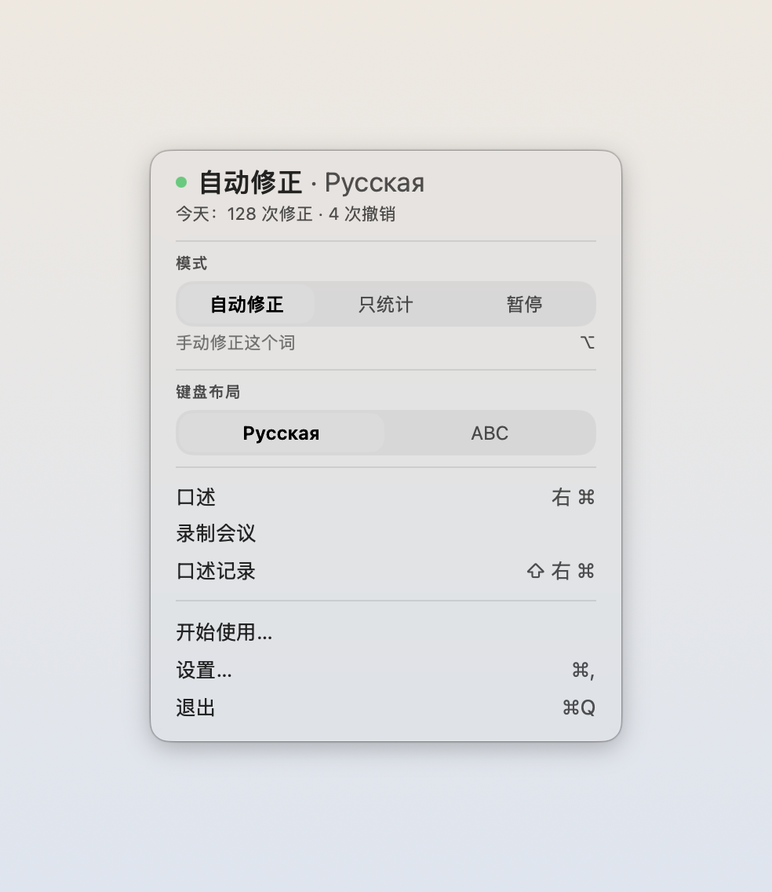

# iriz

你说出来，屏幕上就有字。语音识别在你的 Mac 上完成；向代理发送文本需要你另行同意。

[English](README.md) · [Русский](README.ru.md)

[](LICENSE) [](https://github.com/zarubinvibe/iriz/stargazers) [](https://github.com/zarubinvibe/iriz) [](https://github.com/zarubinvibe/athena#olympuz-family)

<p align="center"></p>

<!-- owner-welcome:start -->

> 你好。我是个律师，也写代码，而且打字打得很多。打得不算慢，可一天下来还是发现，半天时间都花在敲字上了。
>
> 试过几个工具之后，我明白了一件很简单的事：我说出来的比敲出来的准。敲字的时候我在挑词；说话的时候不挑，念头是整的，另一头的模型也更明白我要什么。挡在中间的只有一件事，隐私。所以这里把界划清楚了：该留在我这儿的，只在我自己的机器上识别；出去的，只有我自己送出去的那部分，比如翻译，或者把我说的话整理成任务。
>
> 还有最开始那件小事：我总忘了切输入语言，一句话敲成了另一套布局。在这儿它自己会改回来。
>
> — Filipp Zarubin

<!-- owner-welcome:end -->

## 目录

- [这是什么](#这是什么)
- [它解决什么问题](#它解决什么问题)
- [最大的优势](#最大的优势)
- [工作流程](#工作流程)
- [快速开始](#快速开始)
- [简单对比](#简单对比)
- [简单词汇](#简单词汇)
- [安全与隐私](#安全与隐私)
- [局限](#局限)
- [点亮星标与参与](#点亮星标与参与)

<!-- application-downloads:start -->

<p align="center"><a href="https://github.com/zarubinvibe/iriz/releases/latest/download/iriz-macos-arm64.dmg"></a><br>
<a href="https://github.com/zarubinvibe/iriz/releases/latest/download/iriz-macos-arm64.dmg">下载 macOS 版</a> · 直接下载</p>

<p align="center">macOS · Apple Silicon — macOS 14+ · DMG</p>

<p align="center">设置: 首次启动时，选择下载并安装 Parakeet。语音模型需另行下载，约 500 MB。</p>

<p align="center">安全: 应用使用自签名，尚未通过 Apple 公证。此下载不支持 Intel。</p>

<p align="center"><a href="docs/DOWNLOAD.zh.md">安装与首次听写</a> · <a href="https://github.com/zarubinvibe/iriz/releases/latest">所有版本</a> · <a href="https://github.com/zarubinvibe/iriz/releases/latest/download/SHA256SUMS.txt">校验和</a></p>

<!-- application-downloads:end -->

<!-- beginner-readme:start -->

## 这是什么

这是一个 Mac 应用：你说话，它替你打字。

用起来是这样。按一下键，用平常的声音说话，再按一下。文字会落在光标原来的位置：邮件里、聊天里、搜索框里。不用切换到别的地方，也没有单独的窗口。

和同类应用最大的区别在于语音在哪里被解码。通常你的声音会被送到别人的服务器，在那里变成文字再回来。这里是你的 Mac 在计算，声音不会离开这台机器。

**为什么叫「iriz」。** 伊里斯是希腊神话里众神的信使，也是彩虹——连接天与地的桥。她不编造消息，只把它完整地带到。这个名字对应的是把语音转成文字的工作。自动识别仍会听错词，结果需要你核查。



它还会别的。它能修好用错键盘布局打出来的句子。粘贴之后你改了一个词，它会问要不要记住这个替换。普通口述可以去掉犹豫和重复。

会议处理会保留原始识别文本和录音。DOCX 先放纪要，再另起一页放完整的可用转写；同一文件夹还包含 JSON 和待核实事项。通过所选代理填写决策和任务前，会单独征求发送文本的同意。未知信息会明确标注，结果仍是草稿。[会议处理说明](docs/MEETINGS.md)。


## 它解决什么问题

靠写字吃饭的人，每天都有几个小时花在打字上。同一个想法，说出来更快也更完整：打字时人在挑词，说话时不挑。

只有一件事挡在前面。云端听写把口语整理得比任何本地方案都干净，可你说的内容也随之离开了这台机器：和客户的通话、文件草稿、人名和金额。对医生、律师、心理咨询师来说，这笔交换怎么算都不划算。

所以这里由你的 Mac 来识别，只有你按下按钮时，程序才会联网。


## 最大的优势

**最大的优势：** 语音识别在你的 Mac 上完成，无需把音频发送到云端识别服务。

**为什么这样更好：** 识别期间，语音库自身的模型下载器保持关闭。这个设置不是系统防火墙：模型下载和 CLI 代理使用各自的网络连接。

## 工作流程

按键，说一句话，再按一下。文字会落在光标闪烁的地方。

这段时间里，屏幕下方一直有一颗玻璃水滴。你不说话时它很小。一开口，里面就有声波流动：这就是“它有没有听见我”的答案。


把鼠标移上去，水滴会展开成一排按钮：录音、提示词、翻译、语言、历史、设置。语言就在这里切换，开口前一秒就能换，不用专门去设置里找。


如果没能粘贴上，什么也不会丢：同一个浮窗会展开成面板，文字从那里拿走。


<!-- workflow-diagram:start -->

<p align="center"></p>

<!-- workflow-diagram:end -->

| 阶段 | 会发生什么 |
|---|---|
| 1. 按键 | 一个键，在哪个程序里都一样 |
| 2. 说话 | 你说话，小提示条告诉你它在听 |
| 3. 识别 | Mac 用自己的芯片把话变成字 |
| 4. 落字 | 文字落在光标刚才闪的地方 |

### 第 1 步：按下你的那个键

默认是右边的 Command。按下去就行，Mac 上别的什么都不用改：不用先开窗口，也不用先把光标放到哪儿。这个键要是被占了，在引导里当场换掉，不用去设置里翻。

<p align="center"></p>

**你会得到：** 一个在编辑器、邮件和终端里都答应的键。

### 第 2 步：说出来

光标旁边会出现一条小提示，上面的波形跟着你的声音走。普通听写只在识别期间将音频保留在内存中，不保存录音；会议录音则另外保存在归档中。

<p align="center"></p>

**你会得到：** 普通听写模式下，你会得到文字，不留下录音文件。

### 第 3 步：Mac 本机识别

识别跑在这台 Mac 的 Neural Engine 上：七秒话大约零点一秒就出结果。音频在本机处理，识别库自身的下载器保持关闭。后续若由代理处理文本，需要你的同意。

<p align="center"></p>

**你会得到：** 在本机识别得到的转录；是否发给代理，由你另外决定。

### 第 4 步：文字落进输入框

它进的是你本来就待着的那个输入框：邮件、聊天窗口、终端。要是那个框不收，小提示会展开成一块面板，整段文字都在里面，点一下就进剪贴板。你伸手去拿的这段时间里，它不会丢。

<p align="center"></p>

**你会得到：** 文字进了框，或者还能从面板里整段拿走。

## 快速开始

[下载 macOS DMG](https://github.com/zarubinvibe/iriz/releases/latest/download/iriz-macos-arm64.dmg)，打开后将 iriz 拖入 Applications。需要 Apple Silicon Mac 和 macOS 14 或更新版本，不需要 Xcode 或终端。

打开 iriz，在引导中点击「下载并安装 Parakeet」（约 500 MB），然后按后续步骤授予权限。等模型就绪，将光标放入文本框，再试用听写快捷键。

[安装、恢复模型和更新](docs/DOWNLOAD.zh.md)。从源码构建请使用已验证的 Xcode 26.6（macOS 26 SDK、Swift 6.3.3），命令及其他安装方式见下方。

```bash
git clone https://github.com/zarubinvibe/iriz.git ~/iriz
cd ~/iriz
bash install.sh          # просто терминал, без единого агента
code .                   # или открой папку в редакторе
claude                   # или пусти агента: он проведет установку разговором
```

没有 Git？下载[源码 ZIP](https://github.com/zarubinvibe/iriz/archive/refs/heads/main.zip)，解压后运行同一个安装脚本。也可以在 Claude Code 中打开项目并运行 `/iriz-setup`，让智能体逐步引导安装，每次安装前都会先询问。

第一次做这件事？[上手引导](docs/ONBOARDING.zh.md) 会一步一步带你走完第一次运行，并写清楚每条命令之后你会看到什么。

**你会得到：** 安装脚本先说清楚这是什么，再看你的机器缺什么，跑一遍 `bash scripts/selfcheck.sh --selftest`，最后告诉你下一步该做什么。你不开口，它什么都不装。真要构建，加一个参数：`bash install.sh --build`。

## 简单对比

| 方案 | 适合什么时候 | 你会得到 | 语音去哪儿 | 管不管布局 | 代价 |
|---|---|---|---|---|---|
| **iriz** | 口述的是工作材料，不能交出去 | 布局、本机听写、口述变任务 | 音频在本机识别；向代理发送文本需征得同意 | 管，英俄这一对 | 俄语优先，还没做公证 |
| 自己手打 | 就一句话，偶尔一次 | 每个字都在你手里 | 哪儿也不去 | 不管 | 长文本要吃掉一晚上 |
| Punto Switcher | 只需要换布局 | 多年打磨的布局纠正 | 哪儿也不去 | 管 | 完全没有听写 |
| macOS 自带听写 | 偶尔说一两句 | 系统里已经有了 | 除非开了离线模型，否则去 Apple | 不管 | 专业词很弱，也不会整理成任务 |
| Wispr Flow 这类 | 把颠三倒四的话理顺 | 清洗效果目前最好 | 它们的服务器 | 不管 | 当事人的名字跟着文本一起走 |
| 本地 Whisper 应用 | 不想用云的听写 | 同样在你机器上算 | 哪儿也不去 | 不管 | 不纠正布局，也不把口述整理成任务 |

## 简单词汇

| 词 | 简单解释 |
|---|---|
| Repository | 仓库：Git 保存并记录版本的项目文件夹 |
| Terminal | 终端：你输入命令的窗口 |
| Command | 命令：给电脑的一条指令 |
| Branch | 分支：不影响 `main` 的另一条修改线 |
| Pull Request | 合并请求：请别人审阅并接受你的修改 |
| Neural Engine | 苹果芯片里只管神经网络的那一块：识别快，机器也不发烫 |
| 语音模型 | 把声音转成文字的模型权重，保存在你的磁盘上。Parakeet 需单独下载，约 500 MB，由你按按钮启动。 |

## 安全与隐私

- 普通听写不会保存录音。会议录音的副本会保留在 iriz 归档中。
- 不读屏幕。没有 ScreenCaptureKit，也不截窗口。
- 为了在听写后建议词语更正，iriz 会通过辅助功能读取当前焦点输入框的文本，但不会保存该输入框的完整内容。
- 你在哪里听写过，不记录。否则磁盘上会攒起你和谁、在什么时候工作的痕迹。
- 粘贴之后，剪贴板放回原样。
- 保存的转录仅允许所有者访问：文件夹权限为 0700，文件为 0600。文件是明文，应用不会加密。

语音模型和可选的说话人模型由各自的按钮启动下载，下载时不会发送音频或文本。提示词模式、翻译和代理文本清理会在你同意后，通过所选 CLI 发送文本。生成会议纪要时，应用会另行询问是否发送完整转录，不发送音频。CLI 的配置决定请求地址；本地运行的 CLI 也可能连接远程服务器，服务商可能收费。

## 局限

状态：可用。作者每天都在用它口述。

- 此下载面向 Apple Silicon 和 macOS 14 及以上。Intel 未经验证；不支持 Windows、Linux 或 iPad。
- 自动修正键盘布局只支持英语和俄语。界面支持俄语、英语和简体中文。
- 应用使用自签名，尚未通过 Apple 公证。首次启动的安全提示见下载指南。
- 默认 Parakeet 模型需要单独下载，约 500 MB，不识别中文语音。其他模型支持的语言不同。
- 更新需手动完成：下载新 DMG，退出 iriz，再替换应用。模型与历史记录保存在应用包之外。

更深入：[逐步上手，每个界面都有截图](docs/ONBOARDING.zh.md)、[如何参与](CONTRIBUTING.zh.md)、[安全](SECURITY.zh.md)。

## 点亮星标与参与

觉得有用？给 iriz 点亮星标：[https://github.com/zarubinvibe/iriz](https://github.com/zarubinvibe/iriz)。这只要一秒，却决定别人能不能找到这个项目。

想改点什么？流程很短：先 fork 仓库，建一个分支 branch，提交 commit，推送 push，然后开一个 Pull Request。请不要直接向 `main` 推送，发布闸门会拒绝。

发现问题？到 [https://github.com/zarubinvibe/iriz/issues](https://github.com/zarubinvibe/iriz/issues) 开一个 issue，写清楚你运行了什么、发生了什么。

<!-- beginner-readme:end -->

<!-- pantheon-family:start -->
## Olympuz 家族

这是 [Olympuz 家族](https://github.com/zarubinvibe/athena#olympuz-family) 的公开项目之一。表格里的每一行都可以打开仓库，或者直接下载源码压缩包。

| 类型 | 名称 | 做什么 | 如何帮到这个项目 | 获取 |
|---|---|---|---|---|
| 项目 | Athena | 可携带的智能体操作系统：在新的 Mac 上重建 Claude 与 Codex 的工作环境。 | 一次运行就在新机器上铺好智能体的工作环境：规则、技能、钩子。 | [仓库](https://github.com/zarubinvibe/athena) · [ZIP](https://github.com/zarubinvibe/athena/archive/refs/heads/main.zip) |
| 项目 | Helioz | 全天候的智能体工作传送带，带可验证的完成标记和按目标做出的夜间决策。 | 让智能体的工作全天候运转，每个任务都以可验证的标记收尾。 | [仓库](https://github.com/zarubinvibe/helioz) · [ZIP](https://github.com/zarubinvibe/helioz/archive/refs/heads/main.zip) |
| 项目 | Mnemazine | 本地优先的记忆系统：把原始材料变成可复用的、已核验的知识。 | 把截图、PDF、链接这些素材，变成经过核实的知识笔记。 | [仓库](https://github.com/zarubinvibe/mnemazine) · [ZIP](https://github.com/zarubinvibe/mnemazine/archive/refs/heads/main.zip) |
| 项目 | Themiz | 面向俄罗斯诉讼的多智能体助手，本地识别扫描件，五位法学家组成合议审阅。 | 以多智能体处理俄罗斯法院案件，材料保存在本地。 | [仓库](https://github.com/zarubinvibe/themiz) · [ZIP](https://github.com/zarubinvibe/themiz/archive/refs/heads/main.zip) |
| 项目 | Zeuz | 工作流工厂：把一个想法变成带规则、闸门、可观测性和回放的多智能体系统。 | 搭建带规则、闸门、可观测性和重放的多智能体工作流。 | [仓库](https://github.com/zarubinvibe/zeuz) · [ZIP](https://github.com/zarubinvibe/zeuz/archive/refs/heads/main.zip) |
| 项目 | Lynceuz | 以零成本收集公开网页证据；安全路径走完时，它会给出诚实的理由并停下。 | 零成本从公开网络收集证据，走到边界就诚实地停下。 | [仓库](https://github.com/zarubinvibe/lynceuz) · [ZIP](https://github.com/zarubinvibe/lynceuz/archive/refs/heads/main.zip) |
| 项目 | Iriz | macOS 菜单栏听写：语音在你自己的 Mac 上解码，键盘布局自动纠正，口述可以直接变成给智能体的任务。 | macOS 菜单栏听写：语音在你自己的 Mac 上解码，键盘布局自动纠正。 | [仓库](https://github.com/zarubinvibe/iriz) · [ZIP](https://github.com/zarubinvibe/iriz/archive/refs/heads/main.zip) |
| 项目 | Mantoz | 把一个想法摆到五百个并不存在的人面前，然后告诉你每个群体是怎么答的。 | 在真人看到之前，先把想法摆在几百个生成出来的人面前。 | [仓库](https://github.com/zarubinvibe/mantoz) · [ZIP](https://github.com/zarubinvibe/mantoz/archive/refs/heads/main.zip) |
| 项目 | Koiz | 所有项目共用一份教训库。每次失败都追到原因，原因不被钩子、闸门或测试关掉，就一直挂在那里。 | 为所有项目保存同一份教训库，并且要求机制，而不是承诺。 | [仓库](https://github.com/zarubinvibe/koiz) · [ZIP](https://github.com/zarubinvibe/koiz/archive/refs/heads/main.zip) |
<!-- pantheon-family:end -->

## 许可证

MIT。见 [LICENSE](LICENSE)。
