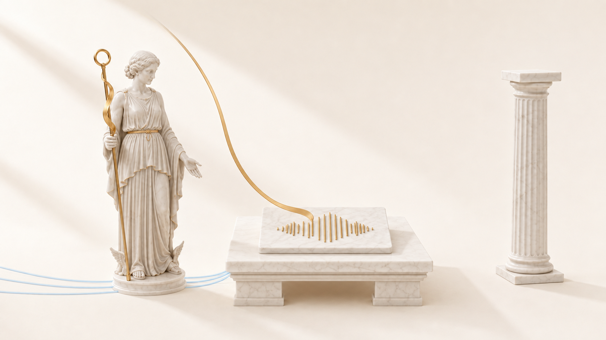

# The conversation at the first install

<!-- owner-greeting:start -->

<p align="center"></p>

Hello. I am Fil, a lawyer who vibe-codes, and I wrote iriz.

From here an agent takes over. It will tell you what it is about to do BEFORE it does it, and
name the price of every step: what appears on the disk, where the time goes, where you have a
choice. If something does not suit you, say so right in the chat — a step can be skipped.

One promise this whole thing was built for: the audio of your speech never leaves the machine.
The single trip to the network is the speech model download, and you start it with a button.

<!-- owner-greeting:end -->

## Step 1: look at what you are running

**What I do:** check the macOS version, the processor, and whether Xcode with Swift 6 is here.

**Why:** iriz lives on macOS 14 and newer. The glass plate and real Liquid Glass are macOS 26;
on 14 and 15 the app works, but the plate is drawn the old way. Better to know that now than
after the build.

**What changes on disk:** nothing. This is reading.

**What you get:** an answer whether we go on, and which visual branch you land on.

**Fork:** no Xcode is not a problem. Take the ready disk image from the Releases page and we
skip the build steps.

## Step 2: bring the sources in

**What I do:** clone the repository into a folder you name, or unpack the ZIP.

**Why:** everything after this happens inside that folder, and it should sit where you will
find it later.

**What changes on disk:** one folder appears, about 40 MB. Nothing else is written anywhere.

**What you get:** a project tree where you can see `Sources`, `Tests`, `scripts` and `docs`.

## Step 3: build the app

**What I do:** run `bash install.sh`, read its report with you, and only then
`bash install.sh --build`.

**Why:** without the flag the installer installs nothing. It explains what the program is,
looks at what your machine is missing, and runs a self-check of the tree. This is your chance
to stop before anything happens.

**What changes on disk:** the first command changes nothing. The second pulls Swift
dependencies (about 300 MB into `.build`) and puts the finished app into `/Applications`.

**What you get:** an icon in the menu bar at the top right, and the welcome window.

**Fork:** if you would rather not hand over `/Applications`, say so — we build into the project
folder and run it from there.

## Step 4: grant the permissions and download the model

**What I do:** walk you through three macOS permissions — microphone, Accessibility, Input
Monitoring — and start the speech model download.

**Why:** without the microphone there is nothing to hear, without Accessibility there is
nowhere to paste, without Input Monitoring the key is not heard at all. The model is the half
a gigabyte for which the app goes online exactly once.

**What changes on disk:** the model lands in `~/Library/Application Support/iriz/Models`. The
permissions are written into the macOS database, not into the app.

**What you get:** working dictation. Press the key, say a sentence, press again — the text
lands where the cursor was blinking.

## Step 5: check that it is all honest

**What I do:** run the project gates and show you their whole output.

**Why:** the promise «the audio never leaves the machine» is checked by an instrument, not by a
paragraph in the README. The gate kicks the set of networking symbols in the built binary and
asks the kernel whether the running app holds a single open socket.

**What changes on disk:** nothing. The gates only read and count.

**What you get:** a green report you saw with your own eyes instead of taking on trust.

```bash
bash scripts/verify.sh && bash scripts/offline_binary_gate.sh
```
