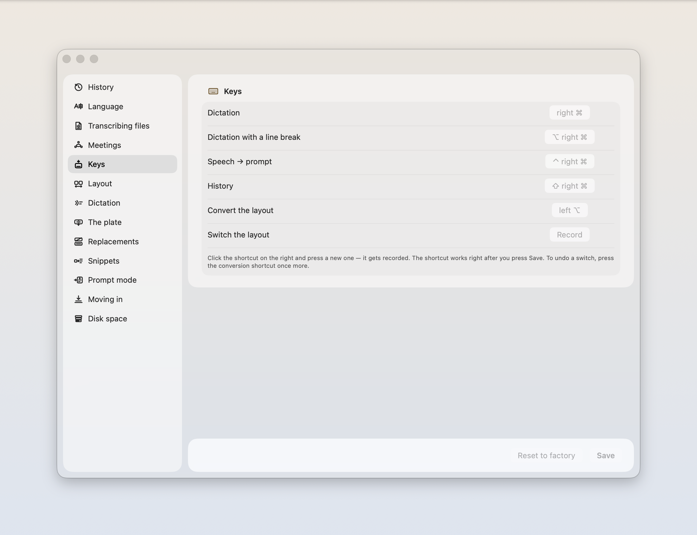
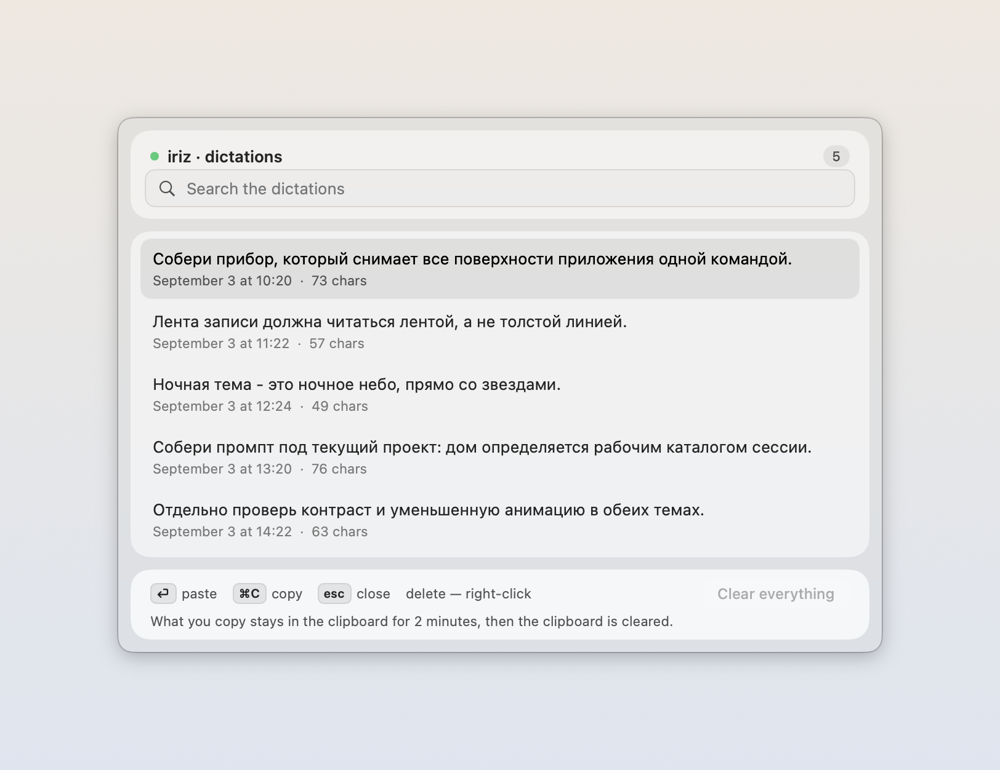
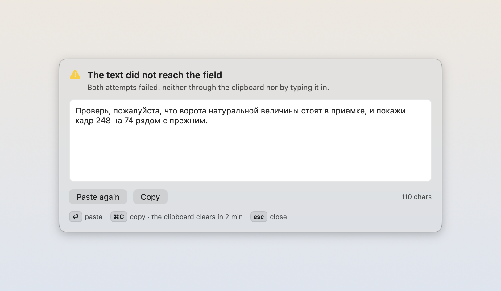
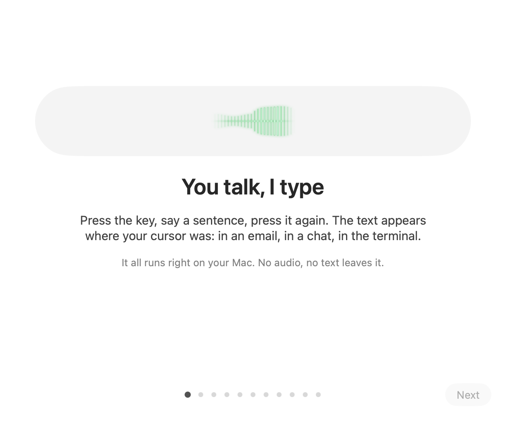

# Onboarding

[Русский](ONBOARDING.ru.md) · [简体中文](ONBOARDING.zh.md) · [README](../README.md)

Start here: follow [Install](#install), [First launch](#first-launch), and [Test](#test) in order.

Status: ready for Apple Silicon Macs on macOS 14 or newer; Intel is not supported.

<p align="center"></p>

<p align="center"></p>

This icon will appear in your menu bar. During ordinary dictation, your speech turns into text on your Mac and the audio never leaves it. Optional agent modes may send the recognized text only after you consent.
This guide is for someone installing iriz for the first time. Each step tells you what to press or type and what should appear next. If you see something different, stop at that step. The difference is the clue.

You need an Apple Silicon Mac running macOS 14 or newer. Keep roughly 500 MB free for the one-click Parakeet model, plus space for temporary download files. This build does not support Intel. Building from source uses the tested Xcode 26.6 toolchain (macOS 26 SDK, Swift 6.3.3). The ready-made DMG needs neither Xcode nor Terminal.

The [installation guide](DOWNLOAD.md) covers downloading, first launch, model recovery, manual updates and rollback. The steps below also walk through the rest of the app.

## Install

1. **Check your system.** Open the Apple menu in the top-left corner and choose **About This Mac**.

   You will see the Mac model and macOS version. You need macOS 14 or newer. Stop here if the version is older because iriz will not run on it.

2. **Download the disk image.** Get the [DMG for Apple Silicon](https://github.com/zarubinvibe/iriz/releases/latest/download/iriz-macos-arm64.dmg). The release page also lists it as `iriz-<version>-arm64.dmg`. There is no Intel or universal build in this release.

   A file of a few dozen megabytes will appear in Downloads. That size is expected. The speech model is not inside the image. You will install it with one button in step 7.

3. **Drag iriz into Applications.** Double-click the downloaded `.dmg`.

   A window will open with two items and an arrow between them: the iriz icon and the `Applications` folder. Drag the icon onto the folder. Then close the window and eject the disk image from the Finder sidebar.

4. **Or build it yourself instead of doing steps 2 and 3.** Open Terminal and run:

   ```bash
   git clone https://github.com/zarubinvibe/iriz.git ~/iriz
   cd ~/iriz
   bash install.sh
   ```

   Without flags, the installer does not build or install anything. It explains the app, checks what your Mac has and what is missing, runs the tree self-check at `scripts/selfcheck.sh`, then prints the next command. To verify the offline promise instead of taking it on trust, run `scripts/offline_binary_gate.sh` on the app built by `install.sh`. When the checks are clear, build it:

   ```bash
   bash install.sh --build
   ```

   The first build downloads dependencies, so later builds are shorter. When it finishes, the app is in `/Applications` and its icon appears in the menu bar. You can also download the source as a [ZIP](https://github.com/zarubinvibe/iriz/archive/refs/heads/main.zip), unpack it and run the same command inside that folder. The installer still needs Git.

5. **Open the app for the first time.** This release uses an ad-hoc signature, without a Developer ID certificate, and is not notarized by Apple, so macOS cannot verify the publisher.

   If macOS says it cannot verify the publisher or check the app, continue only if you trust this repository and have checked the download. Try to open iriz from Applications, then choose **System Settings → Privacy & Security → Open Anyway**. Apple explains this process in its [support guide](https://support.apple.com/en-us/102445).

   If macOS says the app is damaged, stop and download it again from the official release. Do not bypass malware warnings or disable Gatekeeper. If the warning remains, stop and report the problem.

   If you built the app yourself in step 4, skip this step. macOS does not put the same download quarantine on that build.

   You should now see the iriz icon at the top right, near the clock, and the **Meet iriz** window.

## First launch

6. **Read the first screen.** The **Next** button at the bottom leads to model installation.

   This screen explains the basic loop: press a key, say a sentence, press the key again, and the text appears where the cursor was blinking.

7. **Install a model by the shortest route.** On **Install speech recognition**, press **Download and install Parakeet**. iriz downloads Parakeet TDT v3, installs it and selects it for recognition.

   The download is about 500 MB. Its speed depends on your connection, and progress stays visible on the screen. You can press **Next** and grant permissions while it downloads. Before your first dictation, wait for **Model is in place**. After an error, press **Try again**.

   Skipped the model or need to retry later? Open **iriz → Settings → Dictation → Download Parakeet model…**. If a model is already installed, the button reads **Set up speech recognition…**. Automatic installation is available only for Parakeet, and Parakeet does not recognize Chinese speech. The author uses a manually installed Whisper large-v3-turbo instead. [Compare the supported profiles and other download candidates](MODELS.md). Interface language and speech language are separate settings.

   The next screen shows where iriz lives. It has no Dock icon or main window. History, replacements, settings and meeting recording all open from the menu bar icon. Continue to permissions.

8. **Allow microphone access.** On **Microphone needed**, press **Allow microphone**.

   macOS will show a system prompt. Allow access. Back in the onboarding window, the status changes to **Done**. Without microphone access, layout repair still works, but dictation does not.

9. **Allow Accessibility access.** On **Permission needed to paste text**, press **Open System Settings**.

   macOS opens the Accessibility list. Find `iriz` and turn on its switch yourself. The system does not let the app do this for you. Return to the onboarding window and check that the status says **Done**. iriz needs this permission to paste finished text into an email, chat or other app.

10. **Allow Input Monitoring.** On **One permission left: the keyboard**, press **Open System Settings** again. This time macOS opens the Input Monitoring list. Turn on the switch next to `iriz`.

    iriz restarts when you enable the switch. macOS requires that restart, so nothing is broken. The onboarding window opens again at the same place. Without this permission, iriz cannot see the dictation shortcut or repair a word typed in the wrong keyboard layout.

## Test

11. **Dictate your first sentence inside the onboarding window.** Wait until the model is ready. On **Try it right now**, press the right ⌘ key, say something, then press it again.

    Right ⌘. Say: "Hi, this is a test. Can you hear me okay?" Right ⌘ again. While you speak, the screen says **listening, go ahead**. After the second press, it says **figuring out what you said**, then your text appears in the field. While onboarding is open, dictation goes only into this field. If another app already uses the shortcut, choose **Key taken? Change it** on the same screen.

12. **Skip the two optional agent screens unless you want them.** The next screens are **Turn speech into an agent task** and **Say it in Russian, get it in English**.

    This is where the fully local path ends, and the app says so on the screen. A separate shortcut sends the recognized text to an external agent CLI that you installed and signed into yourself. The agent turns rough speech into a task. Translation uses the same agent: you speak in Russian and the app pastes English. These modes stay off until you enable them. **Skip for now** is safe. Dictation and layout repair work without an agent, and you can return to these modes in Settings.

13. **Close onboarding and dictate into a real field.** Press **Done**. Open Notes or another app with a text field, then click where you want the cursor to blink.

    Press right ⌘, speak, then press right ⌘ again. The text should appear at the cursor. The same action works in email, chat and Terminal. Check layout repair too: type `ghbdtn` and watch it change to `привет`.

### If the text did not appear

14. **Recover the text.** It is not lost. The last onboarding screen explains the same recovery path.

    - The dictation plate expands into a panel with the full transcript. Copy it from there.
    - Right ⌘ + ⇧ opens History. Press ⏎ to paste, ⌘C to copy or Esc to close. Your dictations are stored there.
    - If nothing happens and the icon stays silent, click the menu bar icon. iriz names the missing permission there. Input Monitoring is the usual cause.
    - If the same word is misheard repeatedly, add a replacement under **iriz → Settings… → Replacements**. The raw transcript stays unchanged. The replacement affects only the text sent to the target field.

## Keep it current

For a DMG installation, follow [manual updating and rollback](DOWNLOAD.md#update-or-go-back). Quit iriz before replacing it, then keep the previous app or disk image until the new version works.

If you build from source, open the project in Claude Code and run `/iriz-update`. It shows what will change, pulls only fast-forward changes, and leaves your settings, replacements and dictations alone.

## If this helped

If iriz kept even one dictation out of someone else's cloud, give the repository a star: [https://github.com/zarubinvibe/iriz](https://github.com/zarubinvibe/iriz). It takes a second and helps other people find the project.

You have now walked the full path, so you can spot where it is rough. To improve it, fork the repository, create a branch, commit the change, push the branch and open a Pull Request. Do not push directly to `main`; the release gate rejects it.

If something broke or a step was wrong, open an issue at [https://github.com/zarubinvibe/iriz/issues](https://github.com/zarubinvibe/iriz/issues). Say what you did and what appeared on screen. An inaccurate step in this guide is a bug.

## What it looks like

Every surface below was captured from the live app with `iriz --capture-docs`. These are not mockups. They show the windows you will see.

### The plate

<p align="center"></p>

This is how the plate looks while you are silent. It floats above other windows and waits.

<p align="center"></p>

This is how it looks while you speak. The wave inside the glass confirms that iriz can hear you.

<p align="center"></p>

Point at the plate and it opens into buttons for recording, prompts, translation, language, history and settings. You can drag it to any of twelve positions along the screen edges.

<p align="center"></p>

Click the plate to open its text panel. Close it with the close button, Escape or a click outside the controls.

### The menu bar

<p align="center"></p>

Everything else opens from this menu. The top line shows what iriz is doing now.

### Settings

<p align="center"></p>

There are thirteen pages: History, Language, Transcribing files, Meetings, Keys, Layout, Dictation, Plate, Replacements, Snippets, Prompt mode, Moving in and Disk space.

### Dictation history

<p align="center"></p>

The window shows the latest one hundred dictations and keeps the latest five hundred. Search covers everything that is kept.

### Text that did not get pasted

<p align="center"></p>

If pasting did not reach the field, the text waits here.

### Onboarding

<p align="center"></p>

Onboarding has eleven screens. You can reopen it from the menu at any time.
