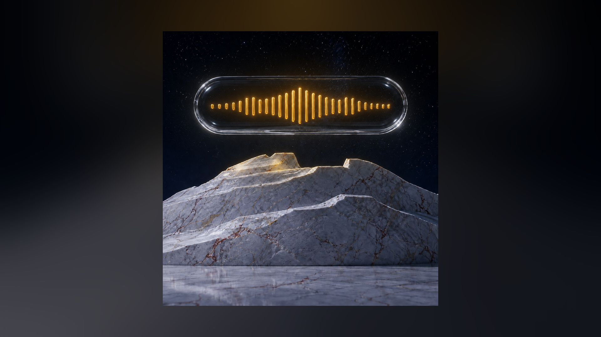

# Знакомство

<p align="center"></p>

<p align="center"></p>

Вот значок, который появится у вас в строке меню. Мраморная гора и голос, собранный в стеклянную капсулу над ней: сказанное превращается в текст прямо здесь, на вашей машине, и никуда не улетает.
Этот путь написан для человека, который ставит iriz первый раз в жизни. В каждом шаге сказано, что нажать или набрать, и что после этого появится на экране. Увидели другое, чем написано, остановитесь прямо там. Ответ лежит в этом расхождении, а не ниже по странице.

Нужен Мак на macOS 14 или новее. Если решите собирать из исходников, понадобится еще Xcode со Swift 6. Больше ничего заранее ставить не надо.

1. **Посмотрите, какая у вас система.** Меню Apple в левом верхнем углу, пункт «Об этом Маке».

   Откроется окно с названием и номером версии. Нужна 14 или новее. Версия старше, дальше идти незачем: приложение на ней не запустится.

2. **Скачайте образ.** Откройте [страницу выпусков](https://github.com/zarubinvibe/iriz/releases) и возьмите верхний. Файлов на выбор два: `iriz-<версия>-arm64.dmg` для Маков на Apple Silicon и `iriz-<версия>-universal.dmg`, внутри которого оба среза. Не знаете, какой у вас процессор, берите universal.

   В «Загрузках» появится файл на десяток мегабайт. Так и должно быть. Модель распознавания в образ не кладется намеренно, приложение скачает ее само на шаге 7.

3. **Перетащите значок в Applications.** Двойной щелчок по скачанному `.dmg`.

   Откроется окно, в котором два предмета и стрелка между ними: значок приложения и папка `Applications`. Перетащите первое на второе. Потом закройте окно и вытолкните образ из бокового списка Finder, чтобы он не висел смонтированным.

4. **Либо соберите сами, вместо шагов 2 и 3.** В терминале:

   ```bash
   git clone https://github.com/zarubinvibe/iriz.git ~/iriz
   cd ~/iriz
   bash install.sh
   ```

   Без флагов установщик ничего не ставит. Он рассказывает, что это за программа, смотрит, чего не хватает на машине, гоняет самопроверку дерева `scripts/selfcheck.sh` и называет следующий шаг. Увидите список: что есть, чего нет. Захотите проверить обещание про сеть, а не поверить ему на слово, прогоните `scripts/offline_binary_gate.sh` на приложении, собранном через `install.sh`. Когда список чистый, соберите:

   ```bash
   bash install.sh --build
   ```

   Первая сборка тянет зависимости и идет несколько минут. В конце готовое приложение окажется в `/Applications`, а значок появится в строке меню. Нет git, скачайте [ZIP](https://github.com/zarubinvibe/iriz/archive/refs/heads/main.zip), распакуйте и запустите ту же команду внутри распакованной папки.

5. **Откройте приложение первый раз.** Тут macOS упрется, и лучше знать об этом заранее. У проекта нет Apple Developer ID, сборка не нотаризована, и на все скачанное из сети система вешает метку карантина.

   Двойной щелчок по `iriz` в `Applications` даст окно вида «Не удалось открыть „iriz“, так как Apple не может проверить его на наличие вредоносного ПО». Реже система пишет, что файл поврежден. Файл цел, это ее самая пугающая формулировка для ненотаризованного приложения.

   Правый щелчок по значку, пункт **«Открыть»**, в появившемся диалоге еще раз **«Открыть»**. На macOS 15 и новее этого пункта может не быть: тогда откройте **Системные настройки → Конфиденциальность и безопасность**, пролистайте вниз до строки про заблокированное приложение и нажмите **«Все равно открыть»**. Запасной путь, работающий на всех версиях:

   ```bash
   find /Applications/iriz.app -exec xattr -d com.apple.quarantine {} \; 2>/dev/null
   ```

   Собрали сами на шаге 4, весь этот шаг вас не касается: на такую сборку карантин не вешается.

   Что вы увидите: значок в строке меню наверху справа, рядом с часами, и окно **«Знакомство с iriz»**.

6. **Пройдите два первых экрана.** Кнопка **«Дальше»** внизу окна.

   Первый экран говорит, что программа делает: нажали клавишу, сказали фразу, нажали еще раз, текст встал туда, где мигал курсор. Второй объясняет, где она живет. Отдельного окна у нее нет, в доке ее нет тоже. История, словарь и настройки открываются из значка в строке меню.

7. **Скачайте распознавание.** Экран **«Скачаем распознавание»**, кнопка **«Скачать модель»**.

   Поедет около полугигабайта, на обычном канале минут пять. Ждать не нужно: жмите «Дальше» и выдавайте разрешения, пока она едет. Когда доедет, на этом экране встанет **«Модель на месте»**. Если загрузка сорвалась, там же появится **«Попробовать снова»**. Это единственный поход приложения в сеть, и запускаете его вы кнопкой.

8. **Разрешите микрофон.** Экран **«Нужен микрофон»**, кнопка **«Разрешить микрофон»**.

   Выскочит системный запрос от macOS. Нажмите разрешающую кнопку. В окне знакомства слово рядом с разрешением сменится с «пока нет» на **«разрешено»**. Без микрофона раскладка работать будет, диктовка нет.

9. **Выдайте универсальный доступ.** Экран **«Нужно разрешение вставлять текст»**, кнопка **«Открыть настройки системы»**.

   Откроется список «Универсальный доступ» в настройках. Найдите там `iriz` и включите переключатель руками: система намеренно не дает сделать это за вас. Вернитесь в окно знакомства, строка скажет **«разрешено»**. Это разрешение нужно, чтобы вставить готовый текст в письмо или чат.

10. **Выдайте мониторинг ввода.** Экран **«Осталось разрешение на клавиши»**, снова **«Открыть настройки системы»**, только список теперь называется «Мониторинг ввода». Тот же переключатель напротив `iriz`.

    Сразу после включения приложение перезапустится само. Так требует macOS, это не поломка. Окно знакомства откроется снова на том же месте. Без этого разрешения программа не видит нажатий вообще: ни клавиши диктовки, ни слова, набранного не в той раскладке.

11. **Продиктуйте первую фразу прямо в окне.** Экран **«Попробуй прямо сейчас»**. Нажмите правый ⌘ (клавиша Command справа от пробела), скажите что-нибудь вслух, нажмите ее еще раз.

    Скажите, например: «Привет, это проверка. Слышишь меня хорошо?» Пока говорите, увидите подсказку «слушаю, говори». После второго нажатия появится «разбираю сказанное», а следом ваш текст в поле окна. Пока знакомство открыто, текст пишется только сюда и никуда больше. Клавиша занята другой программой, там же есть **«Клавиша занята? Поменять»**.

12. **Два экрана, которые можно пропустить.** Дальше идут «Речь можно превратить в задание» и «Скажи по-русски, получи по-английски».

    Тут кончается «все считается у вас на Маке», и об этом сказано прямо в окне. Отдельная клавиша отправляет расшифровку внешнему агентскому CLI, который вы поставили и залогинили сами, а он собирает из сбивчивой речи готовое задание. Через того же агента идет перевод: сказали по-русски, вставилось по-английски. Поэтому режим выключен, пока вы сами его не включите. Кнопка **«Пропустить пока»** здесь честная: диктовка и раскладка работают без агента, а вернуться к этому можно в настройках.

13. **Закройте знакомство и продиктуйте в настоящее поле.** Кнопка **«Готово»**. Откройте Заметки или любое другое место, куда пишут текст, и щелкните в поле, чтобы курсор замигал.

    Правый ⌘, фраза вслух, правый ⌘ еще раз. Текст встанет ровно туда, где мигал курсор. Так же он будет вставать в письме, в чате и в терминале. Заодно проверьте раскладку: наберите `ghbdtn` и посмотрите, как слово само превратится в «привет».

14. **Если текст не встал.** Он не потерян, и последний экран знакомства говорит о том же.

    - Плашка диктовки раскроется в панель и покажет расшифровку целиком. Оттуда ее можно скопировать руками.
    - Правый ⌘ + ⇧ открывает окно истории: ⏎ вставить, ⌘C скопировать, Esc закрыть. Все ваши надиктовки лежат там.
    - Ничего не происходит вовсе, и значок молчит: щелкните по значку в строке меню. Приложение показывает там, какого разрешения не хватает, и не делает вид, что все в порядке. Чаще всего это «Мониторинг ввода».
    - Слово расслышано неправильно и повторяется раз за разом: впишите замену в словарь, значок → **«Настройки…»** → **«Словарь замен»**. Сырая расшифровка при этом не меняется, правка живет только в том тексте, который уходит в поле.

## Как обновляться дальше

Когда выйдет новая версия, не начинайте с чистого листа. Откройте проект в Claude Code и запустите `/iriz-update`. Он сначала покажет, что изменится, потянет изменения только вперед и не тронет ваши настройки, словарь и надиктовки.

## Если это помогло

Если iriz избавил вас от чужого облака хотя бы на одной надиктовке, поставьте ему звезду: [https://github.com/zarubinvibe/iriz](https://github.com/zarubinvibe/iriz). Это одна секунда, а от нее зависит, найдут ли проект остальные.

Вы прошли путь целиком, значит, вы и есть тот человек, который заметит в нем кривое место. Дорога короткая: сделайте fork, заведите ветку, оформите commit, отправьте push и откройте Pull Request. Прямо в `main` пушить не нужно, релизный гейт такой пуш отклонит.

Что-то сломалось или шаг соврал, заведите issue на [https://github.com/zarubinvibe/iriz/issues](https://github.com/zarubinvibe/iriz/issues) и напишите, что делали и что увидели. Неточность в этом файле такая же ошибка, как ошибка в коде.
