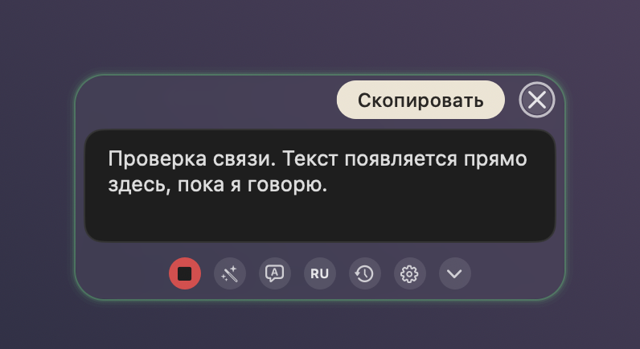
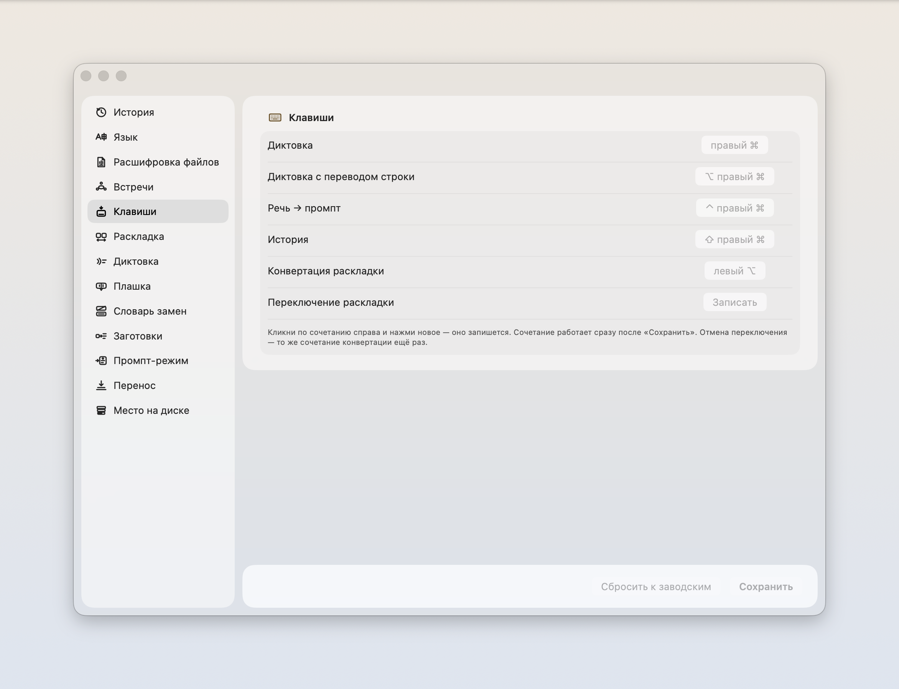
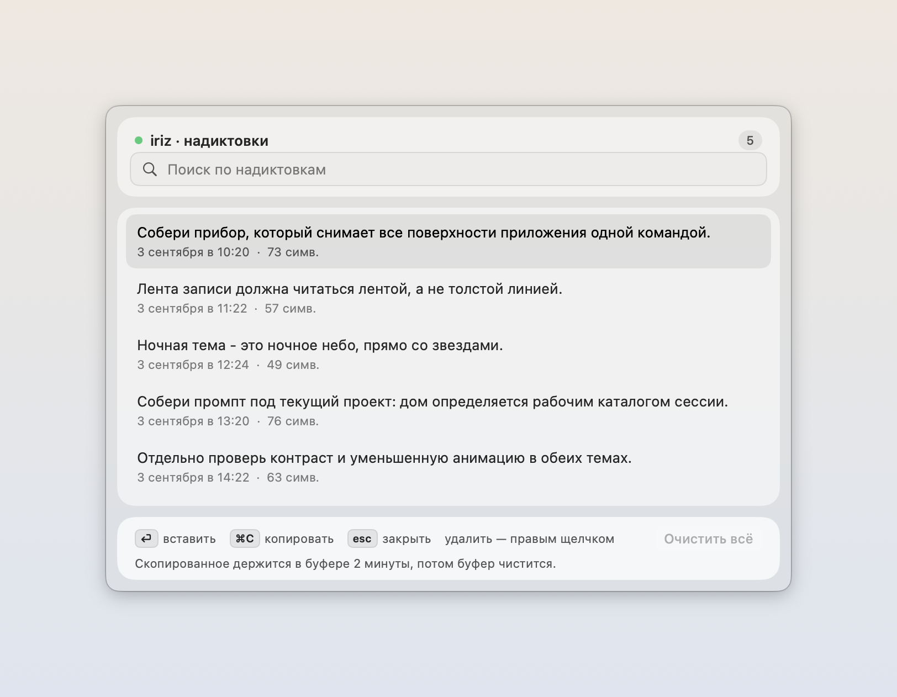
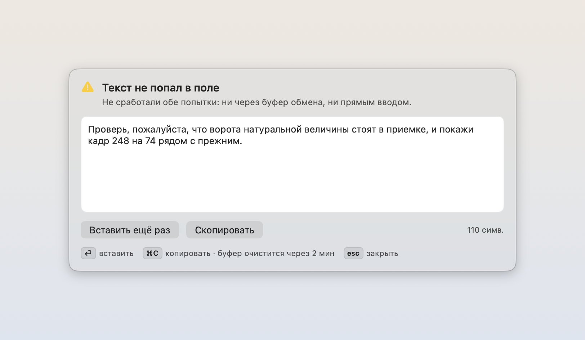
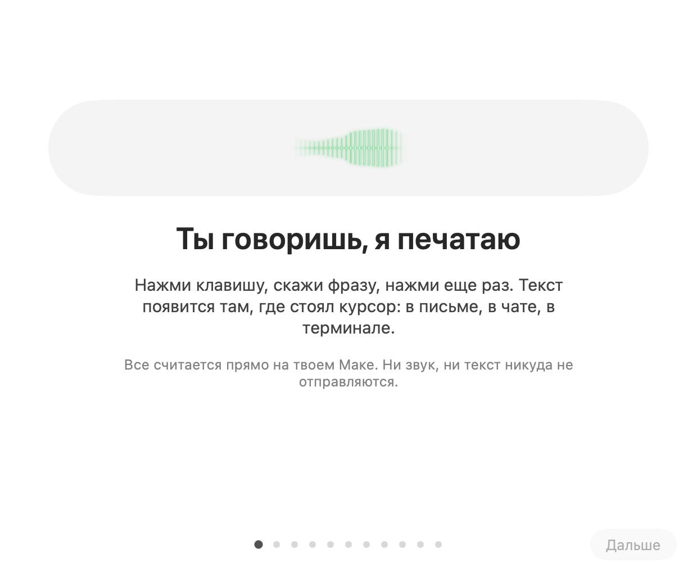

# Знакомство

<p align="center"></p>

<p align="center"></p>

Вот значок, который появится у вас в строке меню. Мраморная гора и голос, собранный в стеклянную капсулу над ней: сказанное превращается в текст прямо здесь, на вашей машине, и никуда не улетает.
Этот путь написан для человека, который ставит iriz первый раз в жизни. В каждом шаге сказано, что нажать или набрать, и что после этого появится на экране. Увидели другое, чем написано, остановитесь прямо там. Ответ лежит в этом расхождении, а не ниже по странице.

Нужен Мак с Apple Silicon на macOS 14 или новее, с местом для модели примерно на 500 МБ и временных файлов загрузки. Этот файл не поддерживает Intel. Для сборки из исходников используется проверенный Xcode 26.6 (macOS 26 SDK, Swift 6.3.3); готовому DMG Xcode и терминал не нужны.

Как скачать приложение, пройти первый запуск, восстановить модель и обновиться вручную, описано в [инструкции установки](DOWNLOAD.ru.md). Ниже разобраны остальные экраны приложения.

1. **Посмотрите, какая у вас система.** Меню Apple в левом верхнем углу, пункт «Об этом Маке».

   Откроется окно с названием и номером версии. Нужна 14 или новее. Версия старше, дальше идти незачем: приложение на ней не запустится.

2. **Скачайте образ.** Возьмите [DMG для Apple Silicon](https://github.com/zarubinvibe/iriz/releases/latest/download/iriz-macos-arm64.dmg). На странице выпуска он также доступен как `iriz-<версия>-arm64.dmg`. Этот выпуск не предназначен для Intel; universal-образ в него не входит.

   В «Загрузках» появится файл на десяток мегабайт. Так и должно быть. Модель распознавания в образ не кладется: приложение скачает и установит ее по кнопке на шаге 7.

3. **Перетащите значок в Applications.** Двойной щелчок по скачанному `.dmg`.

   Откроется окно, в котором два предмета и стрелка между ними: значок приложения и папка `Applications`. Перетащите первое на второе. Потом закройте окно и вытолкните образ из бокового списка Finder, чтобы он не висел смонтированным.

4. **Либо соберите сами, вместо шагов 2 и 3.** В терминале:

   ```bash
   git clone https://github.com/zarubinvibe/iriz.git ~/iriz
   cd ~/iriz
   bash install.sh
   ```

   Без флагов установщик ничего не ставит. Он рассказывает, что это за программа, смотрит, чего не хватает на машине, гоняет самопроверку дерева `scripts/selfcheck.sh` и называет следующий шаг. Увидите список: что есть, чего нет. Захотите проверить обещание про сеть, а не поверить ему на слово, прогоните `scripts/offline_binary_gate.sh` на приложении, собранном через `install.sh`. Когда список чистый, соберите:

   ```bash
   bash install.sh --build
   ```

   Первая сборка тянет зависимости и идет несколько минут. В конце готовое приложение окажется в `/Applications`, а значок появится в строке меню. Исходники можно также скачать как [ZIP](https://github.com/zarubinvibe/iriz/archive/refs/heads/main.zip), распаковать и запустить ту же команду внутри папки. Установщику все равно нужен git.

5. **Откройте приложение первый раз.** У этого выпуска самоподпись, нотаризации Apple нет. macOS не подтверждает издателя.

   Если macOS пишет, что издатель не подтвержден или Apple не может проверить приложение, продолжайте только если доверяете репозиторию и проверили скачанный файл. Попробуйте открыть iriz из Applications, затем выберите **Системные настройки → Конфиденциальность и безопасность → Все равно открыть**. [Объяснение Apple](https://support.apple.com/en-us/102445).

   Если macOS сообщает, что приложение повреждено, остановитесь и скачайте его заново из официального выпуска; считать файл целым без проверки нельзя. Не обходите предупреждение о вредоносном ПО и не отключайте Gatekeeper. Если предупреждение осталось, прекратите запуск и сообщите о проблеме.

   Собрали сами на шаге 4, весь этот шаг вас не касается: на такую сборку карантин не вешается.

   Что вы увидите: значок в строке меню наверху справа, рядом с часами, и окно **«Знакомство с iriz»**.

6. **Прочитайте первый экран.** Кнопка **«Дальше»** внизу окна ведет к установке модели.

   Первый экран говорит, что программа делает: нажали клавишу, сказали фразу, нажали еще раз, текст встал туда, где мигал курсор.

7. **Скачайте распознавание.** Экран **«Установи распознавание речи»**, кнопка **«Скачать и установить Parakeet»**. Приложение скачает, установит и выберет Parakeet для распознавания.

   Скачается около 500 МБ; скорость зависит от соединения, прогресс виден на экране. Пока идет загрузка, можно нажать «Дальше» и выдать разрешения. Перед первой диктовкой дождитесь **«Модель на месте»**. После ошибки есть **«Попробовать снова»**.

   Пропустили модель или хотите повторить загрузку позже? Откройте **iriz → Настройки → Диктовка → Скачать модель Parakeet…**. Если модель уже установлена, кнопка называется **«Настроить распознавание…»**. Автоматическая установка есть только для Parakeet; он не распознает китайскую речь. Другим движкам нужна отдельная установка модели, не описанная здесь. Язык интерфейса и язык речи настраиваются отдельно.

   Следующий экран объясняет, где живет iriz. Отдельного окна у нее нет, в доке ее нет тоже. История, словарь и настройки открываются из значка в строке меню. После этого переходите к разрешениям.

8. **Разрешите микрофон.** Экран **«Нужен микрофон»**, кнопка **«Разрешить микрофон»**.

   Выскочит системный запрос от macOS. Нажмите разрешающую кнопку. В окне знакомства слово рядом с разрешением сменится с «пока нет» на **«разрешено»**. Без микрофона раскладка работать будет, диктовка нет.

9. **Выдайте универсальный доступ.** Экран **«Нужно разрешение вставлять текст»**, кнопка **«Открыть настройки системы»**.

   Откроется список «Универсальный доступ» в настройках. Найдите там `iriz` и включите переключатель руками: система намеренно не дает сделать это за вас. Вернитесь в окно знакомства, строка скажет **«разрешено»**. Это разрешение нужно, чтобы вставить готовый текст в письмо или чат.

10. **Выдайте мониторинг ввода.** Экран **«Осталось разрешение на клавиши»**, снова **«Открыть настройки системы»**, только список теперь называется «Мониторинг ввода». Тот же переключатель напротив `iriz`.

    Сразу после включения приложение перезапустится само. Так требует macOS, это не поломка. Окно знакомства откроется снова на том же месте. Без этого разрешения программа не видит нажатий вообще: ни клавиши диктовки, ни слова, набранного не в той раскладке.

11. **Продиктуйте первую фразу прямо в окне.** Дождитесь готовности модели. Экран **«Попробуй прямо сейчас»**. Нажмите правый ⌘ (клавиша Command справа от пробела), скажите что-нибудь вслух, нажмите ее еще раз.

    Скажите, например: «Привет, это проверка. Слышишь меня хорошо?» Пока говорите, увидите подсказку «слушаю, говори». После второго нажатия появится «разбираю сказанное», а следом ваш текст в поле окна. Пока знакомство открыто, текст пишется только сюда и никуда больше. Клавиша занята другой программой, там же есть **«Клавиша занята? Поменять»**.

12. **Два экрана, которые можно пропустить.** Дальше идут «Речь можно превратить в задание» и «Скажи по-русски, получи по-английски».

    Тут кончается «все считается у вас на Маке», и об этом сказано прямо в окне. Отдельная клавиша отправляет расшифровку внешнему агентскому CLI, который вы поставили и залогинили сами, а он собирает из сбивчивой речи готовое задание. Через того же агента идет перевод: сказали по-русски, вставилось по-английски. Поэтому режим выключен, пока вы сами его не включите. Кнопка **«Пропустить пока»** здесь честная: диктовка и раскладка работают без агента, а вернуться к этому можно в настройках.

13. **Закройте знакомство и продиктуйте в настоящее поле.** Кнопка **«Готово»**. Откройте Заметки или любое другое место, куда пишут текст, и щелкните в поле, чтобы курсор замигал.

    Правый ⌘, фраза вслух, правый ⌘ еще раз. Текст встанет ровно туда, где мигал курсор. Так же он будет вставать в письме, в чате и в терминале. Заодно проверьте раскладку: наберите `ghbdtn` и посмотрите, как слово само превратится в «привет».

14. **Если текст не встал.** Он не потерян, и последний экран знакомства говорит о том же.

    - Плашка диктовки раскроется в панель и покажет расшифровку целиком. Оттуда ее можно скопировать руками.
    - Правый ⌘ + ⇧ открывает окно истории: ⏎ вставить, ⌘C скопировать, Esc закрыть. Все ваши надиктовки лежат там.
    - Ничего не происходит вовсе, и значок молчит: щелкните по значку в строке меню. Приложение показывает там, какого разрешения не хватает, и не делает вид, что все в порядке. Чаще всего это «Мониторинг ввода».
    - Слово расслышано неправильно и повторяется раз за разом: впишите замену в словарь, значок → **«Настройки…»** → **«Словарь замен»**. Сырая расшифровка при этом не меняется, правка живет только в том тексте, который уходит в поле.

## Как обновляться дальше

Для установки из DMG используйте [инструкцию ручного обновления и возврата](DOWNLOAD.ru.md#обновление-и-возврат): закройте iriz перед заменой и сохраните прежнее приложение или образ, пока не проверите новое.

Если собираете из исходников, откройте проект в Claude Code и запустите `/iriz-update`. Он сначала покажет, что изменится, потянет изменения только вперед и не тронет ваши настройки, словарь и надиктовки.

## Если это помогло

Если iriz избавил вас от чужого облака хотя бы на одной надиктовке, поставьте ему звезду: [https://github.com/zarubinvibe/iriz](https://github.com/zarubinvibe/iriz). Это одна секунда, а от нее зависит, найдут ли проект остальные.

Вы прошли путь целиком, значит, вы и есть тот человек, который заметит в нем кривое место. Дорога короткая: сделайте fork, заведите ветку, оформите commit, отправьте push и откройте Pull Request. Прямо в `main` пушить не нужно, релизный гейт такой пуш отклонит.

Что-то сломалось или шаг соврал, заведите issue на [https://github.com/zarubinvibe/iriz/issues](https://github.com/zarubinvibe/iriz/issues) и напишите, что делали и что увидели. Неточность в этом файле такая же ошибка, как ошибка в коде.

## Как это выглядит

Каждая поверхность снята прибором из живого приложения: `iriz --capture-docs`. Не рисунок и не макет: то же окно, что откроется у вас.

### Плашка

<p align="center"></p>

Так она выглядит, пока вы молчите. Капля висит поверх любого окна и ничего не делает.

<p align="center"></p>

Так выглядит капля, пока вы говорите. Волна внутри стекла и есть ответ на вопрос «слышит ли меня».

<p align="center"></p>

Наведите мышь, и капля раскроется в ряд кнопок: запись, промпт, перевод, язык, история, настройки. Плашку можно перетащить, она примагнитится к одному из двенадцати мест по краям экрана.

<p align="center"></p>

Щелчок раскрывает панель с текстом. Выйти можно тремя способами: крестиком, клавишей Escape и щелчком мимо кнопок.

### Меню строки меню

<p align="center"></p>

Отсюда открывается все остальное. Верхняя строка говорит, чем приложение занято прямо сейчас.

### Настройки

<p align="center"></p>

Тринадцать страниц: клавиши, язык, расшифровка файлов, встречи, раскладка, диктовка, плашка, словарь замен, заготовки, промпт-режим, перенос, место на диске.

### История надиктовок

<p align="center"></p>

Показываются последние сто, хранятся последние пятьсот. Поиск ищет по всему, что хранится.

### Текст, который не вставился

<p align="center"></p>

Если вставка не дошла до поля, текст не теряется: он ждет здесь.

### Знакомство

<p align="center"></p>

Одиннадцать экранов при первом запуске. Открыть их заново можно в любой момент из меню.
