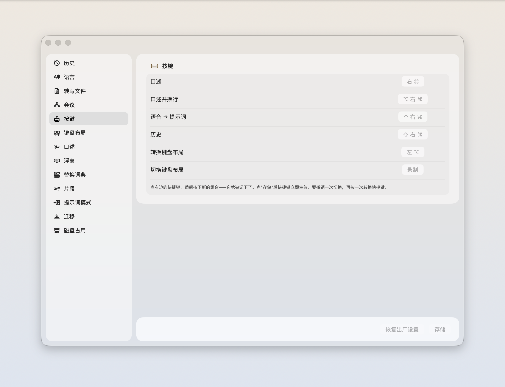
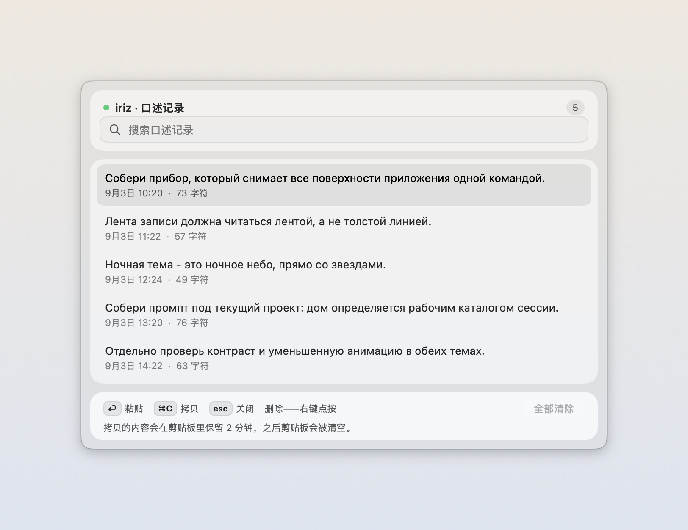
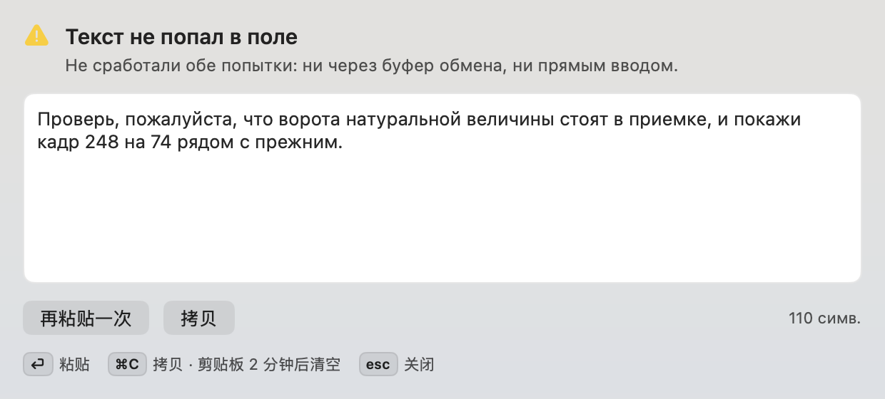
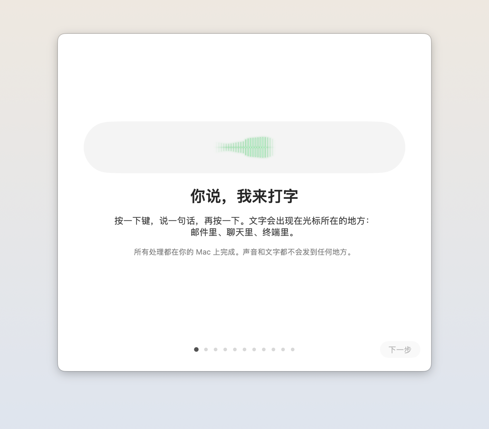

# 上手引导

<p align="center"></p>

<p align="center"></p>

这就是将来出现在你菜单栏里的图标。一座大理石的山，山上方是收进玻璃舱的声音：你说的话就在这台机器上变成文字，不去别处。
这份引导假设你从来没有装过这一类应用。每一步都写清楚你要做什么，以及之后屏幕上应该出现什么。看到的东西对不上，就停在那一步：答案在这个差别里，不在页面下面。

你需要一台装有 macOS 14 或更新版本的 Apple Silicon Mac，以及约 500 MB 模型和下载临时文件所需的空间。此下载不支持 Intel。还需要三项系统权限：麦克风、辅助功能、输入监控。每一项在下面都会点名，说清楚它到底用来干什么。

当前下载、首次启动、模型恢复和手动更新请以[安装指南](DOWNLOAD.zh.md)为准。下面继续介绍应用的其他界面。

有件事先摆在前面，免得你走到第九步才发现：Parakeet 不识别中文语音；布局纠正只处理英文和俄语这一对。界面支持俄语、英语和简体中文，界面语言与语音语言是两项独立设置。下文保留部分俄语按钮名称及中文对照。

1. **先问问这台 Mac 合不合适。** 打开「终端」（在 应用程序 → 实用工具 里），输入并回车：

   ```bash
   sw_vers -productVersion
   ```

   你会看到一个版本号，比如 `15.5`。是 14 或更大就往下走。小于 14 就到此为止，后面的步骤在你机器上不会成立。

2. **拿到应用。** 下载 [Apple Silicon DMG](https://github.com/zarubinvibe/iriz/releases/latest/download/iriz-macos-arm64.dmg)。发布页也提供同一文件的版本名 `iriz-<版本>-arm64.dmg`。此版本不支持 Intel，也不提供 universal 映像。双击镜像，把 iriz 图标拖到旁边的 `Applications` 上。

   你会看到一个窗口，里面只有两个图标和中间一个箭头，再没有别的。镜像只有 10 MB 上下，因为语音模型不在里面——它在第六步由你点击按钮后下载。安装完成后推出映像，从 Applications 启动 iriz。GitHub 自动提供的源码 ZIP 不是可直接安装的应用。

3. **想自己构建就走这条，不想就跳到第四步。** 源码构建使用已验证的 Xcode 26.6（macOS 26 SDK、Swift 6.3.3）；现成 DMG 不需要 Xcode 或终端。从源码装：

   ```bash
   git clone https://github.com/zarubinvibe/iriz.git ~/iriz
   cd ~/iriz
   bash install.sh
   ```

   不带参数的 `install.sh` 什么都不装。它先自我介绍，再看这台机器缺什么：swift、python3、git、系统版本，然后跑 `scripts/selfcheck.sh`。你会看到一列 `есть` / `НЕТ`（有 / 没有），后面跟着一行行 `ok`。全都过了，它会直接告诉你下一句敲什么：

   ```bash
   bash install.sh --build
   ```

   第一次构建要拉依赖，几分钟。跑完 `iriz.app` 就在 `/Applications` 里，用你自己钥匙串里的身份签名。第四步那点麻烦你也就绕过去了：隔离标记只加在从网上下载来的文件上。

4. **第一次打开下载来的构建。** 此版本使用自签名，尚未通过 Apple 公证，macOS 无法验证发布者。

   如果 macOS 提示无法验证发布者或 Apple 无法检查应用，仅在你信任此仓库并已核对下载文件时继续。尝试从 Applications 打开 iriz，然后前往 **系统设置 → 隐私与安全性 → 仍要打开**。请阅读 [Apple 的说明](https://support.apple.com/en-us/102445)。

   如果 macOS 提示应用已损坏，先停止并从官方发布页重新下载，不要直接认定文件完好。不要绕过恶意软件警告，也不要关闭 Gatekeeper。警告仍然出现时，请停止启动并报告问题。

5. **图标出现在屏幕右上角，引导窗口自己弹出来。** iriz 没有主窗口，在程序坞里也别找：它住在菜单栏，时钟旁边。

   你会看到一个标题为 `Знакомство с iriz`（和 iriz 认识一下）的窗口。一屏只讲一件事，底下三个按钮：`Дальше`（下一步）、`Назад`（上一步）、`Пропустить пока`（先跳过）。接下来的五步都在这个窗口里走完。

6. **下载语音识别模型。** 在**安装语音识别模型**页面点击**下载并安装 Parakeet**。应用会下载、安装并选用 Parakeet。

   页面显示约 500 MB 下载的进度，所需时间取决于连接。下载时可以继续授予权限，但开始听写前请等待**模型已就位**。失败后可点击**重试**。

   如果跳过模型或稍后需要重试，打开 **iriz → 设置 → 口述 → 下载 Parakeet 模型…**。已有模型时，按钮显示为**设置语音识别…**。只有 Parakeet 支持自动安装，它不识别中文语音；其他引擎需要另行安装模型，本指南不介绍该过程。

   下一屏介绍 iriz 在菜单栏的位置，以及如何打开历史、词典和设置。读完再继续授予权限。

7. **给麦克风权限。** 按钮 `Разрешить микрофон`（允许麦克风）。

   你会看到 macOS 自己的询问框，点「好」。不给麦克风权限的话，布局纠正照常工作，但应用无法收音，听写用不了。

8. **给「辅助功能」和「输入监控」。** 这两屏的按钮都是 `Открыть настройки системы`（打开系统设置）：开关必须你自己拨，系统不允许应用代劳。

   点第一个，你会被送到 **系统设置 → 隐私与安全性 → 辅助功能**。在列表里找到 iriz，打开开关。这项管的是把文字写进你当前的输入框，没有它，识别出来的话没地方放。

   点第二个，到的是 **输入监控**。系统会警告说这个应用能看到所有程序里的按键，这句话是 macOS 写的，措辞也是它的。iriz 拿它做两件事：知道你按下了听写键，以及发现某个词敲错了布局。按键只在你这台 Mac 上处理，不保存也不外发，密码框里它完全不工作。**开关一拨，应用会自己重启一次**：窗口消失又出现。那是 macOS 的要求，引导在这一屏也提前跟你说了。

9. **试一次听写。** 模型就绪后再开始。引导会把你的听写键印在屏幕上，默认是右 ⌘。按一下，说句话，再按一下。

   你会看到文字落进窗口里那个输入框，它原本的占位文字是 `тут появится то, что ты скажешь`（你说的话会出现在这里）。按了没动静？窗口会直接告诉你键盘权限还没给，并给一个按钮把你送回去补。这一步文字只进这个框；引导结束之后，它进的是你光标所在的任何地方——邮件、聊天窗口、终端，都一样。

10. **接不接 agent，你自己定。** 再往下两屏讲的是「口述转提示词」和「说俄语出英语」。这两件事都要一个外部的 agent 命令行，而且**默认关着**。

    你会看到一份列表：应用在你机器上找到的 agent，每个后面一个 `Подключить`（连接）按钮。一个都没找到，它就说这没什么大不了，听写和布局纠正本来也不用它。这里是「一切都在本机」的终点：连上并打开之后，你的转写文本会离开这台 Mac，交给那个 agent。不想要就一路 `Дальше` 过去，前两个功能一点不受影响。翻译用哪个键，开启之后引导会印在屏幕上。

11. **万一文字没落下来。** 引导的最后一屏专门讲这个，值得看完再关。

    文字没插进去，它不会丢。你会看到听写时那块小提示条展开成一块面板，转写就在里面，从那儿复制走。某个词老是听错，就在菜单栏的词典里改一次，以后它照你写的来。

12. **点 `Готово`（完成），以后从菜单栏用它。** 引导窗口关掉就不会再自己弹了。

    你会看到菜单栏图标底下挂着历史、词典和设置。⌥ 转换最后一个词或选中的内容（只在英文和俄语这一对之间）。右 ⌘ 听写。右 ⌘ + ⇧ 打开历史窗口：⏎ 插入、⌘C 复制、Esc 关闭。所有快捷键都能在设置里重录，两个组合撞在一起会被当场拦下，存不进去。

13. **确认它没有唬你。** 这一步给愿意较真的人，手边得有源码那棵树：

    ```bash
    bash scripts/selfcheck.sh --selftest
    ```

    你会看到一列 `ok`：构建目标和磁盘上的目录对得上，三种语言的页面互相链接，文本里没有作者自己机器上的绝对路径。还想再狠一点，就去看 `scripts/offline_binary_gate.sh`。它把成品二进制里的网络符号钉死在一份固定清单上，然后直接问内核：正在跑的这个应用手上有没有哪怕一个 socket。听写期间应该一个都没有——这句话是这么验出来的。

## 以后怎么更新

通过 DMG 安装的用户，请按[手动更新与回退指南](DOWNLOAD.zh.md#更新与回退)操作：替换应用前先退出 iriz，保留旧应用或映像，直到确认新版可用。

从源码构建的用户，可以在 Claude Code 里打开项目，运行 `/iriz-update`。它先讲清楚会变什么，只做快进式更新，不动你的设置、词典和听写记录，更新完再自检一遍。没有 Claude Code 也行：`git pull` 之后 `bash install.sh --build`。应用没有后台更新器。

## 如果这份引导帮到了你

如果 iriz 替你省下了那些改布局、重打一遍的碎秒，请给它一个星标：[https://github.com/zarubinvibe/iriz](https://github.com/zarubinvibe/iriz)。一秒钟的事，却决定别人还找不找得到它。

你刚从头到尾走了一遍，所以你正是最有资格改进它的人。路径很短：先 fork 仓库，建一个分支，提交 commit，push 上去，然后开一个 Pull Request。请不要直接往 `main` 推：这个仓库的改动都走 Pull Request。

哪一步坏了，或者写得不对？到 [https://github.com/zarubinvibe/iriz/issues](https://github.com/zarubinvibe/iriz/issues) 开一个 issue，写清楚你做了什么、屏幕上出现了什么。这份文件里写错的一步，和代码里的缺陷一样，也是缺陷。

## 界面长什么样

这里的每一个界面都由工具从运行中的应用截取：`iriz --capture-docs`。不是效果图——就是你 Mac 上会打开的那个窗口。

### 浮窗

<p align="center"></p>

你不说话时它就是这样。水滴浮在任何窗口之上，什么也不做。

<p align="center"></p>

你说话时是这样。玻璃里的声波就是“它有没有听见我”的答案。

<p align="center"></p>

把鼠标移上去，水滴会展开成一排按钮：录音、提示词、翻译、语言、历史、设置。浮窗可以拖动，会吸附到屏幕边缘十二个位置之一。

<p align="center"></p>

点一下会展开带文字的面板。有三种关法：叉号、Escape，以及点在按钮以外的地方。

### 菜单栏

<p align="center"></p>

其余功能都从这里打开。第一行告诉你应用此刻在做什么。

### 设置

<p align="center"></p>

十三个页面：按键、语言、转写文件、会议、键盘布局、口述、浮窗、替换词典、片段、提示词模式、迁移、磁盘占用。

### 口述记录

<p align="center"></p>

显示最近一百条，保留最近五百条。搜索会查遍所有保留的内容。

### 没能粘贴上的文字

<p align="center"></p>

如果粘贴没能到达输入框，文字不会丢：它在这里等着。

### 开始使用

<p align="center"></p>

首次启动共十一屏。之后随时可以从菜单里重新打开。
